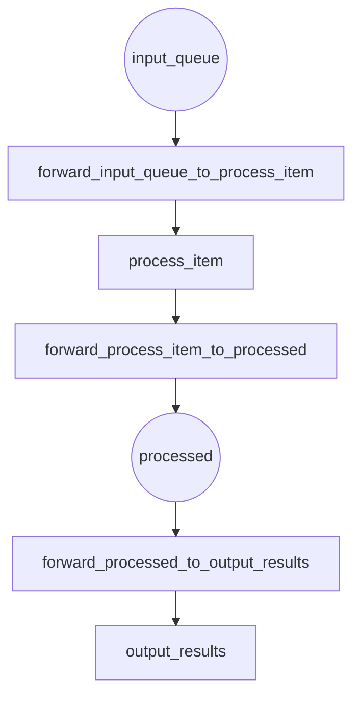

# Your First Hypha Petri Net

This tutorial will walk you through creating a simple Petri Net using Hypha.

## What You'll Build

You'll create a simple workflow that processes items through a queue.

## Step 1: Import Hypha

```python
from mycorrhizal.hypha.core import pn, PlaceType, Runner as PNRunner
from pydantic import BaseModel
```

## Step 2: Define Your Data Models

```python
class WorkItem(BaseModel):
    id: int
    data: str
```

## Step 3: Define the Petri Net

```python
@pn.net
class ProcessingNet:
    @pn.place(type=PlaceType.QUEUE)
    def input_queue(bb):
        return []

    @pn.place(type=PlaceType.QUEUE)
    def processed(bb):
        return []

    @pn.transition()
    async def process_item(consumed, bb, timebase):
        # Get item from input queue
        item = consumed[0].value
        print(f"Processing: {item.data}")

        # Transform the item
        processed = WorkItem(id=item.id, data=item.data.upper())

        return [processed]

    @pn.transition()
    async def output_results(consumed, bb, timebase):
        item = consumed[0].value
        print(f"Output: {item.data}")
        return []  # No output tokens

    # Define arcs (connections)
    @pn.arc
    def input_to_process():
        return pn.Arc(input_queue, process_item)

    @pn.arc
    def process_to_output():
        return pn.Arc(process_item, processed, place_type=PlaceType.QUEUE)

    @pn.arc
    def output_to_final():
        return pn.Arc(processed, output_results)
```

## Step 4: Visualize Your Petri Net (Before Running!)

Before executing your Petri net, you can **export it to a Mermaid diagram** to verify the structure:

```python
# Build the net
net = ProcessingNet()

# Export to Mermaid diagram
mermaid = net.to_mermaid()
print(mermaid)
```

This outputs a diagram showing places, transitions, and connections:



This visualization helps you:
- Verify token flow through the net
- Check that places and transitions are properly connected
- Identify potential bottlenecks or deadlocks
- Document your workflow architecture

**All without running a single transition!**

## Step 5: Run the Petri Net

```python
import asyncio

async def main():
    # Build the net
    net = ProcessingNet()

    # Create runner with initial tokens
    runner = PNRunner(
        net=net,
        initial_tokens={
            "input_queue": [
                pn.Token(value=WorkItem(id=1, data="hello")),
                pn.Token(value=WorkItem(id=2, data="world")),
            ]
        }
    )

    # Run until completion
    await runner.run()

asyncio.run(main())
```

## Expected Output

```
Processing: hello
Processing: world
Output: HELLO
Output: WORLD
```

## Full Example

See the full example in the repository:
```bash
python examples/hypha_demo.py
```

## Next Steps

- Learn about [places and transitions](../../api/hypha.md) in the API reference
- Understand [blackboards](../guides/blackboards.md) for state management
- Explore [composition patterns](../guides/composition.md) with subnets
