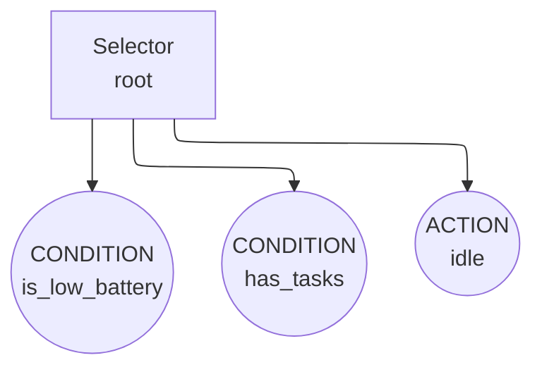

# Your First Rhizomorph Behavior Tree

This tutorial will walk you through creating a simple Behavior Tree using Rhizomorph.

## What You'll Build

You'll create a simple AI decision tree for a robot that needs to decide what to do.

## Step 1: Import Rhizomorph

```python
from mycorrhizal.rhizomorph.core import bt, Runner as BTRunner, Status
from pydantic import BaseModel
from typing import Optional
```

## Step 2: Define Your Blackboard (State)

```python
class RobotContext(BaseModel):
    battery_level: int = 100
    task_queue: list = []
    current_location: str = "home"
    charging_station: str = "home"
```

## Step 3: Define the Behavior Tree

```python
@bt.tree
class RobotAI:
    @bt.action
    async def check_battery(bb: RobotContext) -> Status:
        """Check if battery is low."""
        if bb.battery_level < 20:
            print(f"Battery low: {bb.battery_level}%")
            return Status.SUCCESS
        return Status.FAILURE

    @bt.action
    async def go_charge(bb: RobotContext) -> Status:
        """Navigate to charging station."""
        print(f"Going to charging station at {bb.charging_station}")
        bb.current_location = bb.charging_station
        bb.battery_level = 100
        print("Charged!")
        return Status.SUCCESS

    @bt.condition
    def has_tasks(bb: RobotContext) -> bool:
        """Check if there are tasks to do."""
        return len(bb.task_queue) > 0

    @bt.action
    async def do_task(bb: RobotContext) -> Status:
        """Perform the next task."""
        if not bb.task_queue:
            return Status.FAILURE
        task = bb.task_queue.pop(0)
        print(f"Doing task: {task}")
        bb.battery_level -= 10
        return Status.SUCCESS

    @bt.action
    async def idle(bb: RobotContext) -> Status:
        """Do nothing when no tasks."""
        print("Idling...")
        return Status.SUCCESS

    @bt.root
    @bt.selector
    def root(N):
        """Try battery check first, if that fails, do tasks."""
        yield N.check_battery
        yield N.has_tasks
        yield N.idle

    @bt.sequence
    def charging_sequence(N):
        """Sequence for charging: go_charge then done."""
        yield N.go_charge

    @bt.sequence
    def task_sequence(N):
        """Sequence for doing tasks."""
        yield N.has_tasks
        yield N.do_task
```

## Step 4: Visualize Your Behavior Tree (Before Running!)

Rhizomorph lets you **export your tree to a Mermaid diagram** to visualize the decision logic:

```python
# Create the tree
tree = RobotAI()

# Export to Mermaid diagram
mermaid = tree.to_mermaid()
print(mermaid)
```

This generates a visual representation of your behavior tree:



This visualization reveals:
- The decision flow and fallback logic
- Which nodes run under what conditions
- Whether all nodes are reachable
- Potential issues in the tree structure

**You can verify correctness before executing any behavior!**

## Step 5: Run the Behavior Tree

```python
import asyncio

async def main():
    # Create blackboard with initial state
    bb = RobotContext(
        battery_level=50,
        task_queue=["clean", "cook", "clean"]
    )

    # Create and run the tree
    tree = RobotAI()
    runner = BTRunner(tree=tree, blackboard=bb)

    # Run for several ticks
    for i in range(10):
        print(f"\n--- Tick {i+1} ---")
        await runner.tick()
        if bb.battery_level <= 0:
            print("Battery depleted!")
            break

asyncio.run(main())
```

## Expected Output

```
--- Tick 1 ---
Battery low: 50%
Idling...

--- Tick 2 ---
Battery low: 40%
Idling...

--- Tick 3 ---
Battery low: 30%
Idling...

--- Tick 4 ---
Battery low: 20%
Going to charging station at home
Charged!

--- Tick 5 ---
Charged!
Idling...

--- Tick 6 ---
Doing task: clean
...
```

## Full Example

See the full example in the repository:
```bash
python examples/rhizomorph_example.py
```

## Next Steps

- Learn about [node types](../../api/rhizomorph.md) in the API reference
- Understand [composites](../guides/composition.md) for complex trees
- Explore [subtrees](../guides/composition.md) for modular design
