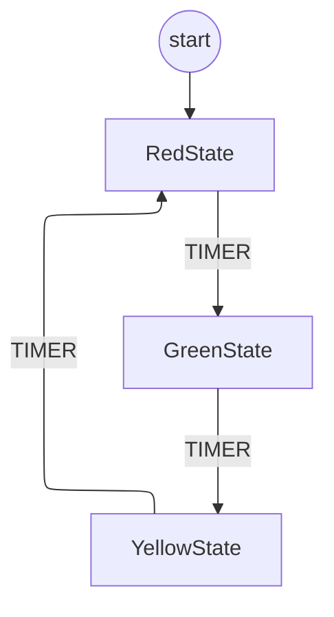

# Your First Septum FSM

This tutorial will walk you through creating a simple Finite State Machine (FSM) using Septum.

## What You'll Build

You'll create a simple traffic light controller with three states: Red, Yellow, and Green.

## Step 1: Import Septum

```python
from mycorrhizal.septum.core import septum, StateMachine
from enum import Enum, auto
```

## Step 2: Define Your States

```python
import asyncio

@septum.state
class RedState:
    class Events(Enum):
        TIMER = auto()

    @septum.on_state
    async def on_state(ctx):
        print("Red light - Stop!")
        await asyncio.sleep(2)  # Wait 2 seconds
        return RedState.Events.TIMER

    @septum.transitions
    def transitions():
        from mycorrhizal.septum.core import LabeledTransition
        return [
            LabeledTransition(RedState.Events.TIMER, GreenState),
        ]
```

```python
@septum.state
class GreenState:
    class Events(Enum):
        TIMER = auto()

    @septum.on_state
    async def on_state(ctx):
        print("Green light - Go!")
        await asyncio.sleep(2)
        return GreenState.Events.TIMER

    @septum.transitions
    def transitions():
        from mycorrhizal.septum.core import LabeledTransition
        return [
            LabeledTransition(GreenState.Events.TIMER, YellowState),
        ]
```

```python
@septum.state
class YellowState:
    class Events(Enum):
        TIMER = auto()

    @septum.on_state
    async def on_state(ctx):
        print("Yellow light - Caution!")
        await asyncio.sleep(1)
        return YellowState.Events.TIMER

    @septum.transitions
    def transitions():
        from mycorrhizal.septum.core import LabeledTransition
        return [
            LabeledTransition(YellowState.Events.TIMER, RedState),
        ]
```

## Step 3: Visualize Your FSM (Before Running!)

One of Septum's powerful features is the ability to **visualize your state machine before execution**. This helps you verify the structure and catch errors early:

```python
from mycorrhizal.septum.util import to_mermaid

# Create the FSM
fsm = StateMachine(initial_state=RedState)
await fsm.initialize()

# Export to Mermaid diagram
mermaid = to_mermaid(fsm)
print(mermaid)
```

This outputs a Mermaid diagram you can view in the [Mermaid Live Editor](https://mermaid.live/):



You can verify:

- All states are reachable from the initial state
- Transitions form a valid cycle
- No states are orphaned or disconnected

This static analysis happens **before you run the code**, so you can catch structural issues immediately!

## Step 4: Create and Run the FSM

```python
import asyncio

async def main():
    fsm = StateMachine(initial_state=RedState)
    await fsm.initialize()

    # Run for 3 cycles
    for _ in range(3):
        await fsm.run()

asyncio.run(main())
```

## Expected Output

```
Red light - Stop!
Green light - Go!
Yellow light - Caution!
Red light - Stop!
...
```

## Full Example

See the full example in the repository:
```bash
python examples/septum_decorator_basic.py
```

## Next Steps

- Learn about [transitions](../../api/septum.md) in the API reference
- Understand [timebases](../guides/timebases.md) for timing control
- Explore [state hierarchies](../guides/composition.md) with push/pop
