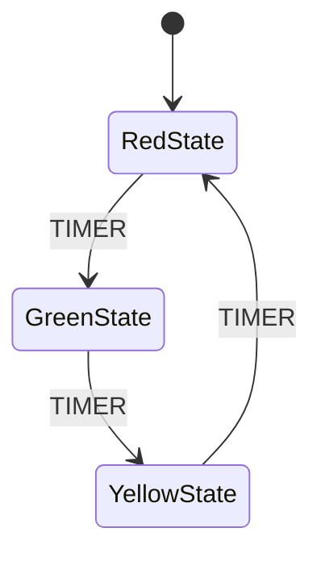

# Observability

Learn how to monitor, debug, and log your Mycorrhizal systems.

## Spores Event Logging

Spores provides structured event and object logging in OCEL (Object-Centric Event Log) format.

### Basic Setup

```python
from mycorrhizal.spores import configure, get_spore_sync
from mycorrhizal.spores.transport import SyncFileTransport

# Configure to log to a file
configure(transport=SyncFileTransport("logs/events.jsonl"))

# Get a logger
spore = get_spore_sync(__name__)
```

### Logging Events

```python
@spore.log_event(
    event_type="TaskCompleted",
    relationships={
        "task": ("return", "Task"),
    },
    attributes={
        "duration": lambda: time.time() - start_time,
    }
)
def complete_task(task_id: str) -> Task:
    task = Task(id=task_id, status="done")
    return task
```

### DSL Adapter Logging

Use `@spore.object()` and `EventAttr` with DSL blackboards:

```python
from mycorrhizal.spores import spore
from mycorrhizal.spores.models import EventAttr, ObjectRef, ObjectScope
from typing import Annotated

class MissionContext(BaseModel):
    mission_id: Annotated[str, EventAttr]
    robot: Annotated[Robot, ObjectRef(qualifier="actor", scope=ObjectScope.GLOBAL)]

@spore.object(object_type="Robot")
class Robot(BaseModel):
    id: str
    name: str

@bt.tree
@spore.object(object_type="MissionControl")
class MissionAI:
    # All node executions will be logged automatically
    pass
```

## Mermaid Diagrams

All DSLs support Mermaid diagram export for visualization.

### Septum State Machine Diagrams

```python
from mycorrhizal.septum.core import StateMachine

fsm = StateMachine(initial_state=MyState)
await fsm.initialize()

# Export to Mermaid
mermaid = fsm.generate_mermaid_flowchart()
print(mermaid)
```

### Rhizomorph Behavior Tree Diagrams

```python
tree = MyTree()

# Export to Mermaid
mermaid = tree.to_mermaid()
print(mermaid)
```

### Hypha Petri Net Diagrams

```python
net = MyNet()

# Export to Mermaid
mermaid = net.to_mermaid()
print(mermaid)
```

### Example Mermaid Output



## Structured Logging

Use Python's logging module alongside Mycorrhizal:

```python
import logging

logging.basicConfig(level=logging.DEBUG)
logger = logging.getLogger(__name__)

@bt.action
async def logged_action(bb):
    logger.info(f"Executing action with bb={bb}")
    # ... do work ...
    logger.debug("Action completed")
    return Status.SUCCESS
```

## Testing and Validation

### Unit Testing Individual Components

```python
import pytest

@pytest.mark.asyncio
async def test_behavior_tree_node():
    bb = MyContext(value=10)
    node = MyAction()

    result = await node.execute(bb)

    assert result == Status.SUCCESS
    assert bb.value == 20
```

### Integration Testing

```python
@pytest.mark.asyncio
async def test_full_system():
    bb = SharedContext()
    tree = MyTree()
    runner = BTRunner(tree=tree, blackboard=bb)

    # Run several ticks
    for _ in range(10):
        await runner.tick()

    # Verify final state
    assert bb.completed_tasks == 5
```

### Property-Based Testing

```python
from hypothesis import given, strategies as st

@given(st.integers(min_value=0, max_value=100))
@pytest.mark.asyncio
async def test_with_various_inputs(value):
    bb = MyContext(value=value)
    result = await my_function(bb)
    assert result.value >= 0
```

## Performance Monitoring

### Track Node Execution Times

```python
import time

@bt.action
async def timed_action(bb):
    start = time.time()
    # ... do work ...
    elapsed = time.time() - start
    print(f"Action took {elapsed:.3f}s")
    return Status.SUCCESS
```

### Track Transition Counts

```python
class TransitionCounter:
    def __init__(self):
        self.counts = {}

    def record(self, from_state, to_state):
        key = f"{from_state} -> {to_state}"
        self.counts[key] = self.counts.get(key, 0) + 1

counter = TransitionCounter()
# Use in state machine transitions
```

## Error Handling

### Graceful Degradation

```python
@bt.action
async def safe_action(bb):
    try:
        result = risky_operation(bb)
        return Status.SUCCESS
    except Exception as e:
        logger.error(f"Action failed: {e}")
        bb.last_error = str(e)
        return Status.FAILURE
```

### Retry Patterns

```python
from mycorrhizal.septum.core import Retry

@septum.state
class RetryingState:
    @septum.on_timeout
    async def on_timeout(ctx):
        if ctx.retry_count < 3:
            print(f"Retry {ctx.retry_count + 1}")
            return Retry()  # Re-enter with incremented retry counter
        return Events.FAILED
```

## Best Practices

1. **Log at boundaries** - Log when entering/exiting major components
2. **Use structured data** - Log objects, not strings
3. **Include context** - Log relevant blackboard state
4. **Monitor performance** - Track execution times
5. **Test edge cases** - Verify error handling works
6. **Use diagrams** - Visualize complex systems

## See Also

- [Spores API](../api/spores.md) - Full logging documentation
- [Best Practices](best-practices.md) - More patterns
- [Composition](composition.md) - Debugging composed systems
