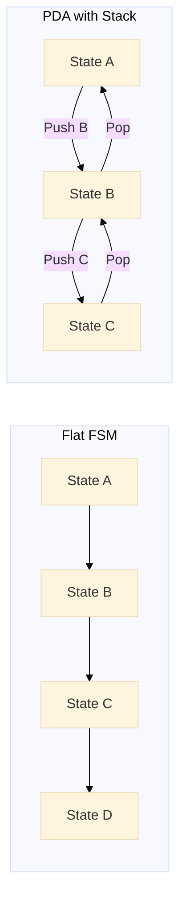
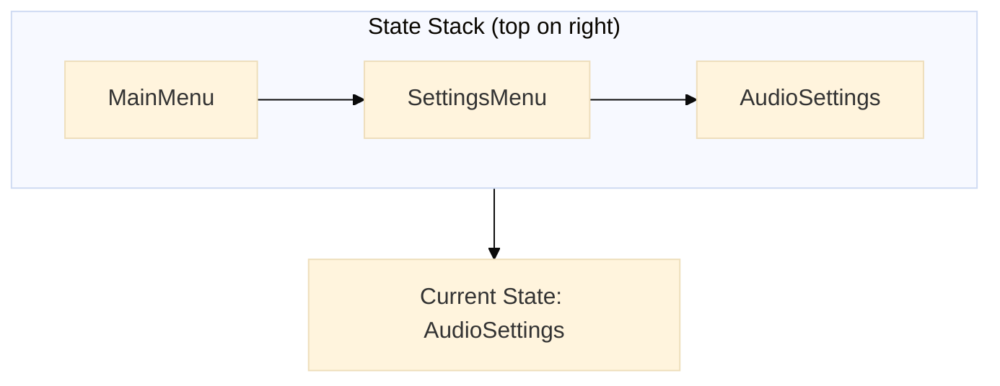
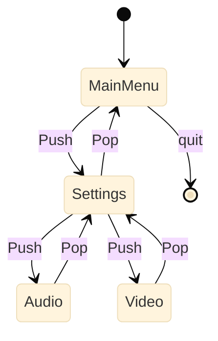
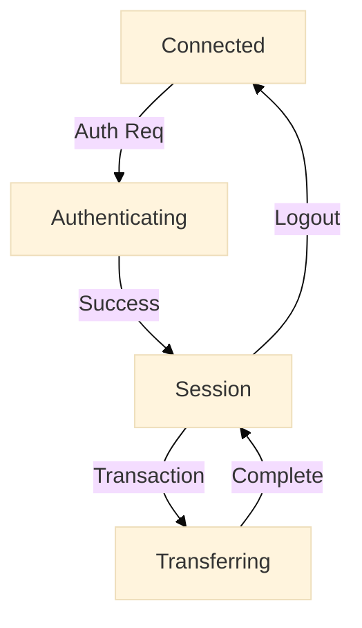
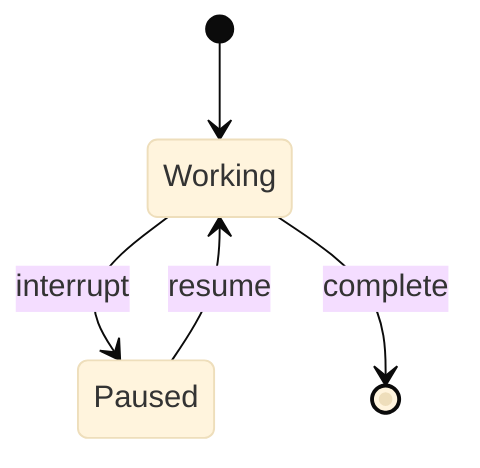
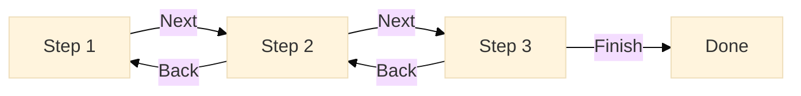
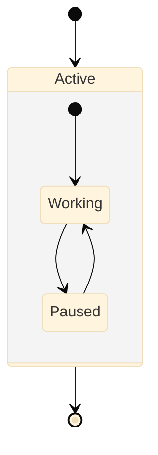
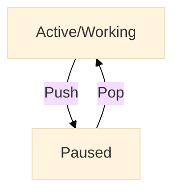
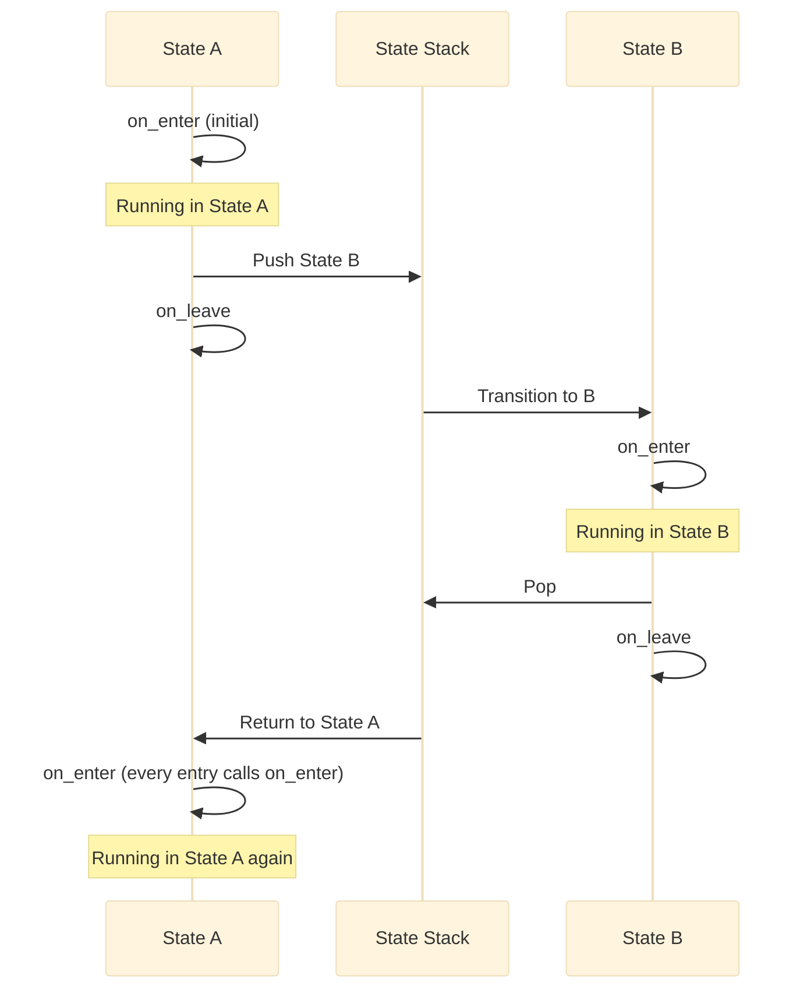
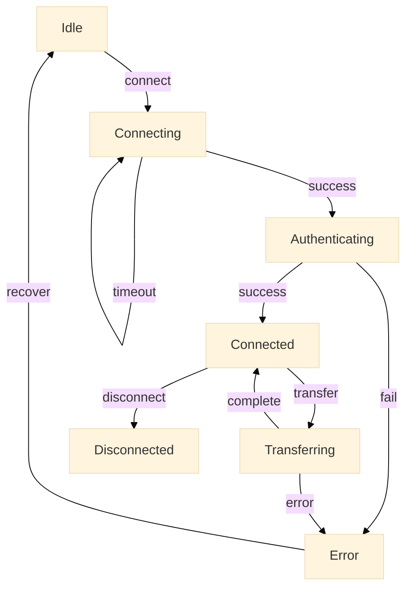

# Septum PDA Guide: Hierarchical State Machines

**Pushdown Automata (PDA)** provide the theoretical foundation for Septum's hierarchical state machine capabilities. This guide explains how Septum's Push/Pop transitions implement stack-based state management, when to use them, and how they differ from flat state machines and Statecharts.

## What is a Pushdown Automaton?

A **Pushdown Automaton (PDA)** is a finite state machine extended with an **unbounded stack**. This stack enables the machine to recognize context-free languages and handle hierarchical structures that flat FSMs cannot manage.

**Key characteristics:**
- **States:** Like a regular FSM, has a finite set of states
- **Stack:** An additional memory structure that can grow/shrink dynamically
- **Push:** Add states to the top of the stack
- **Pop:** Remove and return to the state at the top of the stack

**Wikipedia Reference:** See [Pushdown Automaton](https://en.wikipedia.org/wiki/Pushdown_automaton) for formal definition and theoretical foundations.

### PDA vs Regular FSM

**Regular FSM (Flat):**
- States: A, B, C, D
- Transitions: A → B → C → D
- Limitation: Cannot naturally represent nested contexts

**PDA (Stack-based):**
- States: A, B, C, D
- Stack operations: Push(B), Push(C), Pop
- Capability: Can nest and return to previous contexts



The diagram shows how a PDA can return to previous states (B, then A) using the stack, while a flat FSM cannot naturally express this "return to caller" pattern.

## Septum as a PDA

Septum implements PDA semantics through **Push** and **Pop** transitions:

- **Push(state1, state2, ...)**: Push one or more states onto the stack, transition to the first
- **Pop**: Pop the top state from the stack and return to it

### The Stack Model

Septum's stack works like a call stack in programming:



When you `Pop` from AudioSettings, you return to SettingsMenu. When you `Pop` again, you return to MainMenu.

### Push/Pop Mechanics

**Push Transition:**
```python
from mycorrhizal.septum.core import Push

@septum.state
def MainMenu():
    @septum.on_state
    async def on_state(ctx):
        # User selects "Settings"
        return Events.SHOW_SETTINGS

    @septum.transitions
    def transitions():
        return [
            LabeledTransition(Events.SHOW_SETTINGS, Push(SettingsMenu)),
        ]
```

What happens:
1. Current state (MainMenu) pauses
2. SettingsMenu is pushed onto stack
3. FSM transitions to SettingsMenu
4. When SettingsMenu completes, it can Pop back to MainMenu

**Pop Transition:**
```python
from mycorrhizal.septum.core import Pop

@septum.state
def SettingsMenu():
    @septum.on_state
    async def on_state(ctx):
        # User selects "Back"
        return Events.BACK

    @septum.transitions
    def transitions():
        return [
            LabeledTransition(Events.BACK, Pop),
        ]
```

What happens:
1. Current state (SettingsMenu) calls `on_leave`
2. Top state is popped from stack (MainMenu)
3. FSM transitions back to MainMenu
4. MainMenu's `on_enter` IS called (every entry calls on_enter)

## When to Use Push/Pop

Use Push/Pop when you need **hierarchical navigation** or **nested contexts**:

### 1. Menu Navigation

The classic use case: hierarchical menus that return to parent menus.



**Example:**

```python
@septum.state(config=StateConfiguration(can_dwell=True))
def MainMenu():
    class Events(Enum):
        SETTINGS = auto()
        QUIT = auto()

    @septum.on_state
    async def on_state(ctx):
        if ctx.msg == "settings":
            return Events.SETTINGS
        elif ctx.msg == "quit":
            return Events.QUIT

    @septum.transitions
    def transitions():
        return [
            LabeledTransition(Events.SETTINGS, Push(SettingsMenu, MainMenu)),
            LabeledTransition(Events.QUIT, None),  # Terminal state
        ]

@septum.state
def SettingsMenu():
    class Events(Enum):
        AUDIO = auto()
        VIDEO = auto()
        BACK = auto()

    @septum.on_state
    async def on_state(ctx):
        if ctx.msg == "audio":
            return Events.AUDIO
        elif ctx.msg == "video":
            return Events.VIDEO
        elif ctx.msg == "back":
            return Events.BACK

    @septum.transitions
    def transitions():
        return [
            LabeledTransition(Events.AUDIO, Push(AudioMenu, SettingsMenu)),
            LabeledTransition(Events.VIDEO, Push(VideoMenu, SettingsMenu)),
            LabeledTransition(Events.BACK, Pop),
        ]
```

**Note:** When pushing multiple states, push them in reverse order of execution:
```python
Push(SettingsMenu, MainMenu)  # MainMenu under SettingsMenu on stack
```

### 2. Nested Protocols

Network protocols often have nested states (connection → authentication → session → transaction).



**Example:** See `examples/septum/network_protocol_fsm.py` for a full implementation.

```python
@septum.state(config=StateConfiguration(timeout=3.0, retries=3))
def ConnectingState():
    """Establish connection, then push authentication"""
    class Events(Enum):
        CONNECTED = auto()

    @septum.on_state
    async def on_state(ctx):
        # ... connection logic ...
        return Events.CONNECTED

    @septum.transitions
    def transitions():
        return [
            LabeledTransition(Events.CONNECTED, Push(AuthenticatingState, ConnectedState)),
        ]

@septum.state(config=StateConfiguration(timeout=2.0))
def AuthenticatingState():
    """Authenticate, then pop back to Connected"""
    class Events(Enum):
        SUCCESS = auto()

    @septum.on_state
    async def on_state(ctx):
        # ... authentication logic ...
        return Events.SUCCESS

    @septum.transitions
    def transitions():
        return [
            LabeledTransition(Events.SUCCESS, Pop),
        ]
```

### 3. Interruption and Resumption

Pause an activity, handle an interruption, then resume.



**Example:**

```python
@septum.state
def WorkingState():
    class Events(Enum):
        INTERRUPT = auto()
        COMPLETE = auto()

    @septum.on_state
    async def on_state(ctx):
        if ctx.msg == "interrupt":
            return Events.INTERRUPT
        # ... work logic ...
        return Events.COMPLETE

    @septum.transitions
    def transitions():
        return [
            LabeledTransition(Events.INTERRUPT, Push(InterruptHandler, WorkingState)),
            LabeledTransition(Events.COMPLETE, DoneState),
        ]
```

### 4. Wizard Flows

Multi-step wizards that need to return to previous steps.



**Example:**

```python
@septum.state
def WizardStep1():
    class Events(Enum):
        NEXT = auto()

    @septum.on_state
    async def on_state(ctx):
        # ... step 1 logic ...
        return Events.NEXT

    @septum.transitions
    def transitions():
        return [
            LabeledTransition(Events.NEXT, Push(WizardStep2, WizardStep1)),
        ]

@septum.state
def WizardStep2():
    class Events(Enum):
        NEXT = auto()
        BACK = auto()

    @septum.on_state
    async def on_state(ctx):
        if ctx.msg == "next":
            return Events.NEXT
        elif ctx.msg == "back":
            return Events.BACK

    @septum.transitions
    def transitions():
        return [
            LabeledTransition(Events.NEXT, Push(WizardStep3, WizardStep2)),
            LabeledTransition(Events.BACK, Pop),
        ]

@septum.state
def WizardStep3():
    class Events(Enum):
        FINISH = auto()
        BACK = auto()

    @septum.on_state
    async def on_state(ctx):
        if ctx.msg == "finish":
            return Events.FINISH
        elif ctx.msg == "back":
            return Events.BACK

    @septum.transitions
    def transitions():
        return [
            LabeledTransition(Events.FINISH, DoneState),
            LabeledTransition(Events.BACK, Pop),
        ]
```

## Push/Pop vs Statecharts

**Statecharts** (Harel's statecharts) also support hierarchical states, but with different semantics:

### Statechart Approach

Statecharts use **composite states** with nested substates:



**Characteristics:**
- Hierarchical state nesting
- Substates are **part of** the parent state
- Exit/entry actions for composite states
- Orthogonal regions (parallel execution)
- History states (remember last substate)

### Septum PDA Approach

Septum uses **stack-based state composition**:



**Characteristics:**
- States pushed onto a stack
- Pushed states are **independent**, not substates
- Stack represents call history, not ownership
- No parallel execution (single active state)
- No history states (stack is explicit)

### Key Differences

| Aspect | Statecharts | Septum PDA |
|--------|-------------|------------|
| **Hierarchy** | Parent/child containment | Stack-based call/return |
| **Relationship** | Substate IS-A parent state | Pushed state IS independent |
| **Re-entry** | History (deep/shallow) | Explicit stack |
| **Parallelism** | Orthogonal regions | None (single state) |
| **Complexity** | Higher (more concepts) | Lower (stack only) |

## Stack Depth and Unbounded Growth

### Theoretical Foundation

PDAs have **unbounded stacks**, but real implementations must manage stack depth:

**Wikipedia Reference:** See [Context-Free Grammar](https://en.wikipedia.org/wiki/Context-free_grammar) for the relationship between PDAs and CFGs.

### Stack Depth Validation

Septum validates PDA properties during construction:

```python
from mycorrhizal.septum.core import ValidationError

# This will trigger a warning:
@septum.state
def ProblematicState():
    @septum.transitions
    def transitions():
        return [
            # Pushing self without Pop → unbounded growth
            LabeledTransition(Events.LOOP, Push(ProblematicState)),
        ]
```

**Validation warnings (simple patterns only):**
- Direct self-push without obvious Pop path
- Pop operations without corresponding Push in all code paths

**Note:** Detecting all possible unbounded stack growth is theoretically undecidable (halting problem). Septum validates obvious patterns during construction, but complex cycles may require runtime testing and analysis.

### Practical Stack Management

**Avoid unbounded growth:**
- Always provide a Pop path for pushed states
- Don't push the same state indefinitely
- Validate stack depth at runtime if needed

**Example: Safe self-push with conditions:**
```python
@septum.state
def SafeLoopState():
    class Events(Enum):
        RECURSE = auto()
        DONE = auto()

    @septum.on_state
    async def on_state(ctx):
        depth = ctx.common.get("depth", 0)
        if depth < 5:
            ctx.common["depth"] = depth + 1
            return Events.RECURSE
        return Events.DONE

    @septum.transitions
    def transitions():
        return [
            LabeledTransition(Events.RECURSE, Push(SafeLoopState)),
            LabeledTransition(Events.DONE, Pop),
        ]
```

## Lifecycle Methods with Push/Pop

Understanding when lifecycle methods are called is critical:

### on_enter Behavior

**WARNING:** `on_enter` is called EVERY time a state is entered, including when popping back from the stack. This is counter-intuitive behavior that catches many developers off guard.

> **Important:** Unlike some state machine frameworks, Septum calls `on_enter` on **every** state entry, including when returning from a Push/Pop. This is by design but requires careful handling of state initialization.

**Normal transition:** `on_enter` is called
- State A → State B: B's `on_enter` is called

**Push transition:** `on_enter` is called for BOTH states
- State A pushes State B: B's `on_enter` is called
- State B pops back to A: A's `on_enter` IS called (every entry triggers it)

**Example (corrected):**
```python
@septum.state
def MainMenu():
    @septum.on_enter
    async def on_enter(ctx):
        # Use ctx.common for state persistence
        ctx.common["enter_count"] = ctx.common.get("enter_count", 0) + 1
        print(f"MainMenu entered {ctx.common['enter_count']} times")

    # ... transitions ...

# Flow:
# 1. MainMenu on_enter called (count = 1)
# 2. Push SettingsMenu
# 3. Pop back to MainMenu
# 4. MainMenu on_enter IS called (count = 2, fresh entry)
```

### on_leave Behavior

**Always called** when leaving a state (via normal transition, Push, or Pop).

```python
@septum.state
def StateA():
    @septum.on_leave
    async def on_leave(ctx):
        print("Cleaning up StateA")

    @septum.transitions
    def transitions():
        return [
            LabeledTransition(Events.GO_TO_B, StateB),  # on_leave called
            LabeledTransition(Events.PUSH_C, Push(StateC)),  # on_leave called
        ]
```

### Complete Lifecycle Example



## Common Patterns

### Pattern 1: Nested Contexts with Cleanup

```python
@septum.state
def EditorState():
    """Main editor state"""
    @septum.on_enter
    async def on_enter(ctx):
        # Initialize or reinitialize editor data
        # Note: on_enter is called even when popping back
        if "editor_data" not in ctx.common:
            # Load fresh data on first entry
            ctx.common["editor_data"] = {
                "unsaved": False,
                "content": ""
            }

    @septum.on_leave
    async def on_leave(ctx):
        # Cleanup when leaving (before push or pop)
        if ctx.common["editor_data"]["unsaved"]:
            # In real code: prompt to save, auto-save, or discard
            ctx.common["editor_data"]["unsaved"] = False

    @septum.transitions
    def transitions():
        return [
            LabeledTransition(Events.OPEN_SETTINGS, Push(SettingsState, EditorState)),
        ]

@septum.state
def SettingsState():
    """Settings overlay"""
    @septum.on_state
    async def on_state(ctx):
        if ctx.msg == "apply":
            # Apply settings to editor context
            if "editor_data" in ctx.common:
                # Settings affect editor without modifying data
                pass
            return Events.DONE
        return Events.DONE

    @septum.transitions
    def transitions():
        return [
            LabeledTransition(Events.DONE, Pop),
        ]
```

**Flow:**
1. EditorState.on_enter: Initialize data (first time only)
2. Push SettingsState
3. EditorState.on_leave: Mark as clean before leaving
4. SettingsState runs
5. Pop back to EditorState
6. EditorState.on_enter IS called (check if data exists, reinitialize if needed)

### Pattern 2: Error Recovery with Stack

```python
@septum.state
def ProcessingState():
    @septum.on_state
    async def on_state(ctx):
        # Processing logic that might fail
        ctx.common["processing_data"] = {"attempts": 0}
        return Events.PROCESS

    @septum.transitions
    def transitions():
        return [
            LabeledTransition(Events.ERROR, Push(ErrorRecoveryState, ProcessingState)),
        ]

@septum.state
def ErrorRecoveryState():
    @septum.on_state
    async def on_state(ctx):
        # In real code: attempt recovery (retry, rollback, fallback)
        # Placeholder: simple retry logic
        ctx.common["processing_data"]["attempts"] += 1

        if ctx.common["processing_data"]["attempts"] < 3:
            return Events.RETRY
        else:
            return Events.FAIL

    @septum.transitions
    def transitions():
        return [
            LabeledTransition(Events.RETRY, Pop),  # Resume processing
            LabeledTransition(Events.FAIL, ErrorState),  # Give up
        ]
```

### Pattern 3: Multi-Level Navigation

```python
@septum.state
def Dashboard():
    @septum.transitions
    def transitions():
        return [
            LabeledTransition(Events.REPORTS, Push(ReportsMenu, Dashboard)),
        ]

@septum.state
def ReportsMenu():
    @septum.transitions
    def transitions():
        return [
            LabeledTransition(Events.SALES, Push(SalesReport, ReportsMenu)),
            LabeledTransition(Events.BACK, Pop),
        ]

@septum.state
def SalesReport():
    @septum.transitions
    def transitions():
        return [
            LabeledTransition(Events.DETAILS, Push(SalesDetails, SalesReport)),
            LabeledTransition(Events.BACK, Pop),
        ]
```

**Stack evolution:**
1. Start: []
2. Enter Dashboard: []
3. Push ReportsMenu: [Dashboard]
4. Push SalesReport: [Dashboard, ReportsMenu]
5. Push SalesDetails: [Dashboard, ReportsMenu, SalesReport]
6. Pop (SalesDetails): [Dashboard, ReportsMenu]
7. Pop (SalesReport): [Dashboard]
8. Pop (ReportsMenu): []

## Advanced Topics

### Debugging Stack State

Inspect the stack at runtime:

```python
fsm = StateMachine(initial_state=MyState)
await fsm.initialize()

# Check stack depth
print(f"Stack depth: {len(fsm.state_stack)}")

# Print stack contents
for i, state in enumerate(fsm.state_stack):
    print(f"  {i}: {state.name}")
```

### Handling PopFromEmptyStack

Always ensure states can only Pop when there's something on the stack:

```python
from mycorrhizal.septum.core import PopFromEmptyStack

@septum.state
def SafeState():
    class Events(Enum):
        POP_BACK = auto()
        GO_HOME = auto()

    @septum.on_state
    async def on_state(ctx):
        # Track stack depth in ctx.common to avoid accessing FSM directly
        stack_depth = ctx.common.get("stack_depth", 0)
        if stack_depth > 0:
            return Events.POP_BACK
        else:
            return Events.GO_HOME

    @septum.on_enter
    async def on_enter(ctx):
        # Track when we enter (including after pop)
        ctx.common["stack_depth"] = ctx.common.get("stack_depth", 0)

    @septum.transitions
    def transitions():
        return [
            LabeledTransition(Events.POP_BACK, Pop),
            LabeledTransition(Events.GO_HOME, HomeState),
        ]
```

**Note:** The FSM's `state_stack` is not directly accessible from state handlers. Track stack depth or state in `ctx.common` if you need this information.

### Combining Push with Retry

```python
@septum.state(config=StateConfiguration(retries=3))
def ConnectionState():
    class Events(Enum):
        CONNECTED = auto()
        TIMEOUT = auto()
        MAX_RETRIES = auto()

    @septum.on_state
    async def on_state(ctx):
        # In real code: attempt network connection
        # Placeholder: simulate connection attempt
        success = ctx.common.get("connection_success", False)
        return Events.CONNECTED if success else Events.TIMEOUT

    @septum.on_fail
    async def on_fail(ctx):
        print("Connection failed after retries")
        return Events.MAX_RETRIES

    @septum.transitions
    def transitions():
        return [
            LabeledTransition(Events.CONNECTED, Push(AuthState, ReadyState)),
            LabeledTransition(Events.TIMEOUT, Retry),
            LabeledTransition(Events.MAX_RETRIES, ErrorState),
        ]
```

## Comparison: Flat FSM vs PDA

### Flat FSM Example

Without Push/Pop, you need explicit state chains:

```python
@septum.state
def MainState():
    @septum.transitions
    def transitions():
        return [
            LabeledTransition(Events.SETTINGS, SettingsState),
        ]

@septum.state
def SettingsState():
    @septum.transitions
    def transitions():
        return [
            LabeledTransition(Events.AUDIO, AudioSettingsState),
            LabeledTransition(Events.BACK, MainState),  # Explicit return
        ]

@septum.state
def AudioSettingsState():
    @septum.transitions
    def transitions():
        return [
            LabeledTransition(Events.BACK, SettingsState),  # Explicit return
        ]
```

**Problems:**
- Tightly coupled: AudioSettings must know it came from Settings
- No flexibility: Can't reach AudioSettings from multiple parents
- Manual bookkeeping: Must explicitly track "back" destinations

### PDA Example

With Push/Pop, navigation is implicit:

```python
@septum.state
def MainState():
    @septum.transitions
    def transitions():
        return [
            LabeledTransition(Events.SETTINGS, Push(SettingsState, MainState)),
        ]

@septum.state
def SettingsState():
    @septum.transitions
    def transitions():
        return [
            LabeledTransition(Events.AUDIO, Push(AudioSettingsState, SettingsState)),
            LabeledTransition(Events.BACK, Pop),  # Implicit return
        ]

@septum.state
def AudioSettingsState():
    @septum.transitions
    def transitions():
        return [
            LabeledTransition(Events.BACK, Pop),  # Implicit return
        ]
```

**Benefits:**
- Loose coupling: AudioSettings doesn't know who pushed it
- Flexible: Can reach AudioSettings from any state via Push
- Automatic: Stack tracks "back" destinations

## Real-World Example: Network Protocol

From `examples/septum/network_protocol_fsm.py`:



**Key PDA patterns used:**
1. Connecting → Push(Authenticating, Connected): Authenticate within connection context
2. Authenticating → Pop: Return to Connected on success
3. Connected → Push(Transferring): Do transfer within session
4. Transferring → Connected: Return to session after transfer

See the full example for implementation details.

## Validation and Static Analysis

Septum validates PDA properties during construction:

```python
fsm = StateMachine(initial_state=MyState)

# Validation runs automatically (simple patterns only):
# - All states are reachable
# - Direct self-push without obvious Pop
# - Pop operations without corresponding Push
# - Deterministic event handling
```

**Important limitations:**
- Detecting all unbounded stack growth is **theoretically undecidable** (halting problem)
- Septum validates obvious patterns (direct self-push, missing Pop paths)
- Complex cycles (A pushes B, B pushes C, C pushes A) require manual review
- Runtime testing may be needed to catch complex unbounded growth

**Warnings to watch for:**
- `State 'X' pushes itself without Pop` → Unbounded stack growth risk (simple case)
- `State 'Y' can Pop without being pushed` → PopFromEmptyStack risk
- `State 'Z' has multiple transitions for event 'E'` → Non-deterministic behavior

## Best Practices

### DO:
- Use Push/Pop for hierarchical navigation (menus, wizards, protocols)
- Provide Pop paths for all Push operations
- Validate stack depth if recursion is possible
- Use `can_dwell=True` for states that wait for user input
- Document stack structure in code comments

### DON'T:
- Use Push/Pop for simple state-to-state transitions (use direct state refs)
- Push the same state indefinitely without a Pop path
- Forget to handle PopFromEmptyStack exceptions
- Use local variables for state persistence (use ctx.common)

### Pattern Checklist:

- [ ] Is this a hierarchical/navigation problem? → Use Push/Pop
- [ ] Is this a simple workflow? → Use direct state transitions
- [ ] Do I need to return to the caller? → Use Push/Pop
- [ ] Can the stack grow unbounded? → Add depth limits or conditions
- [ ] Do I need cleanup on re-entry? → Remember: on_enter IS called on pop, use ctx.common for state

## Summary

**Septum's PDA capabilities** provide:

1. **Theoretical Foundation:** Based on pushdown automata from CS theory
2. **Practical Use Cases:** Menus, wizards, protocols, interruptions
3. **Stack Semantics:** Push adds states, Pop returns to previous
4. **Lifecycle Awareness:** on_enter IS called on every entry (including pop), use ctx.common for state
5. **Validation:** Static analysis catches obvious unbounded growth and empty stack pops (complex cycles require manual review)

**Key Differences from Statecharts:**
- Stack-based (PDA) vs containment-based (Statecharts)
- Explicit call/return vs parent/child nesting
- Independent states vs owned substates
- Simpler model, less expressive in some ways

**When to use Push/Pop:**
- Hierarchical navigation (menus, wizards)
- Nested protocols (connection → auth → session)
- Interruption/resumption scenarios
- Any "call and return" pattern

**Further Reading:**
- [Pushdown Automaton - Wikipedia](https://en.wikipedia.org/wiki/Pushdown_automaton)
- [Context-Free Grammar - Wikipedia](https://en.wikipedia.org/wiki/Context-free_grammar)
- [Statechart - Wikipedia](https://en.wikipedia.org/wiki/State_diagram#Harel_statechart)
- [Septum API Reference](../api/septum.md)
- [Septum Index](../septum/)
