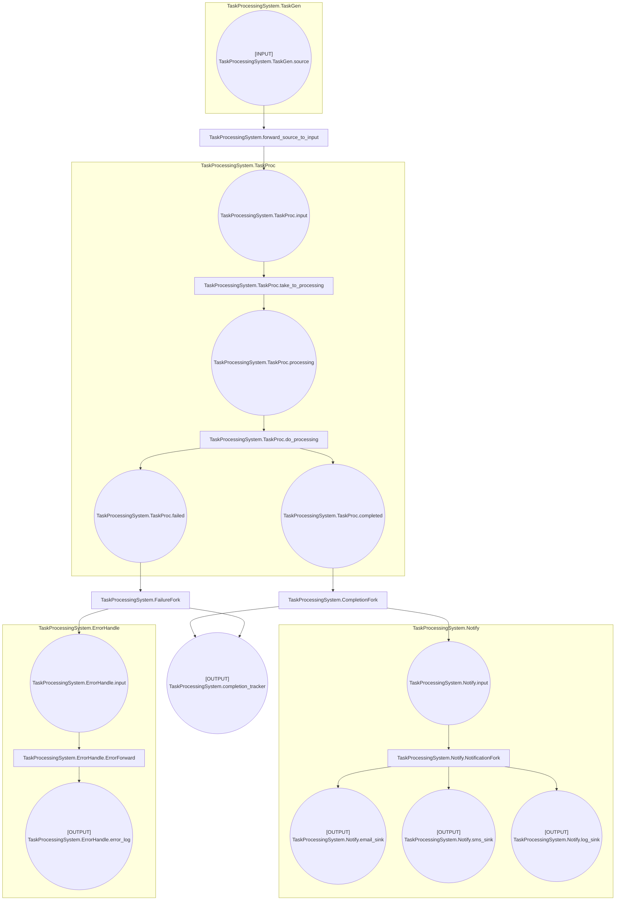

# Hypha Petri Nets

Hypha is a decorator-based Colored Petri Net DSL for modeling concurrent workflows.

## Overview

Hypha Petri Nets provide:

- **Decorator-based syntax** - Define nets, places, and transitions with decorators
- **Colored tokens** - Rich data objects as tokens, not just markers
- **Multi-set places** - All places are bags (multi-sets) supporting token multiplicity
- **Async execution** - Full asyncio support for concurrent transitions
- **Modular composition** - Subnets for hierarchical design

## Quick Example

```python
from mycorrhizal.hypha.core import pn, Runner as PNRunner
from pydantic import BaseModel

class WorkItem(BaseModel):
    id: int
    data: str

@pn.net
def ProcessingNet(builder):
    input_place = builder.place("input")
    processed = builder.place("processed")

    @builder.transition()
    async def process_item(consumed, bb, timebase):
        for token in consumed:
            item = token.data
            print(f"Processing: {item.data}")
            result = WorkItem(id=item.id, data=item.data.upper())
            yield {processed: result}

# Create and run
runner = PNRunner(ProcessingNet, blackboard=WorkItem(id=0, data=""))
await runner.start(timebase)
```

## Key Concepts

### Nets

A net is the container for places and transitions:

```python
@pn.net
def MyNet(builder):
    my_place = builder.place("my_place")

    @builder.transition()
    async def my_transition(consumed, bb, timebase):
        yield {my_place: consumed[0]}
```

### Places

Places hold tokens as multi-sets (bags):

```python
@pn.net
def MyNet(builder):
    # All places are multi-sets (bags)
    work_items = builder.place("work_items")
    results = builder.place("results")
```

### Transitions

Transitions consume and produce tokens:

```python
@builder.transition()
async def my_transition(consumed, bb, timebase):
    """
    Process consumed tokens and yield output tokens.

    Args:
        consumed: List of consumed tokens (from input places)
        bb: Shared blackboard
        timebase: Time abstraction

    Yields:
        Dictionaries mapping place references to tokens
    """
    # Process consumed tokens
    for token in consumed:
        # Produce output tokens
        yield {output_place: processed_token}
```

### Arcs

Arcs connect places to transitions:

```python
# Connect place to transition
builder.arc(input_place, my_transition)
# Chain to connect transition to output
builder.arc(my_transition, output_place)
```

### Guards

A guard chooses the tokens a transition takes. The runtime calls it with the
candidate bindings of the transition, which are all the ways to take tokens from
its input places. A binding holds one tuple per input place, in the order the
arcs were added, and each tuple holds as many tokens as the arc weight. The
guard yields the bindings it accepts. The transition fires with the first one
and consumes exactly its tokens. If the guard yields nothing, or returns
`None`, the transition does not fire.

This net ships an order only from a bin that holds the same SKU:

```python
@pn.net
def Fulfil(builder):
    orders = builder.place("orders")
    stock = builder.place("stock")
    shipped = builder.place("shipped")

    def same_sku(bindings, bb, timebase):
        for b in bindings:
            (order,), (item,) = b
            if order["sku"] == item["sku"]:
                yield b

    @builder.transition(guard=builder.guard(same_sku))
    async def ship(consumed, bb, timebase):
        order, item = consumed
        yield {shipped: (order["id"], item["bin"])}

    builder.arc(orders, ship)
    builder.arc(stock, ship)
    builder.arc(ship, shipped)
```

With one order `{"id": 1, "sku": "bolt"}` and the stock tokens
`{"sku": "nut", "bin": "A3"}` and `{"sku": "bolt", "bin": "C7"}`, the guard
sees two bindings and accepts the second. After the run, `shipped` holds
`(1, 'C7')` and `stock` still holds the nut.

Rules for guards:

- Yield the binding objects you were given. A binding carries the identity of
  its tokens, so two tokens with equal values stay distinct. A guard that
  yields a new tuple raises `TypeError`.
- The bindings arrive one at a time and can be read once. A guard that accepts
  early stops the search early, so a large place costs little when a match
  is near the front.
- Places are multisets. The candidates follow the order the tokens arrived,
  but that order is not part of the contract.
- The runtime evaluates a guard again only after a token is added or a
  transition delay ends. A guard may read the blackboard and the timebase, but
  a change to them alone does not wake the transition. To wait on time, give
  the transition a `delay`.
- Two transitions that fire in the same cycle never take the same token.
- A guard may be an async generator.

## Subnets

Compose nets hierarchically:

```python
@pn.net
def Validator(builder):
    """Reusable validation subnet."""
    input_p = builder.place("input")
    output_p = builder.place("output")

    @builder.transition()
    async def validate(consumed, bb, timebase):
        # Validation logic
        yield {output_p: validated_token}

@pn.net
def MainNet(builder):
    """Main processing net using subnet."""
    input_p = builder.place("input")
    output_p = builder.place("output")

    validator = builder.subnet(Validator, "validator")

    builder.arc(input_p, validator.input)
    builder.arc(validator.output, output_p)
```

## Blackboard Integration

Access and modify shared state:

```python
from pydantic import BaseModel

class NetContext(BaseModel):
    processed_count: int = 0

@pn.net
def CountingNet(builder):
    @builder.transition()
    async def count_and_process(consumed, bb, timebase):
        # Access blackboard
        bb.processed_count += 1
        print(f"Processed {bb.processed_count} items")

        # Process tokens
        yield {output_place: processed_token}
```

## Examples

- [Petri Net Demo](../../examples/hypha/hypha_demo.py) - Basic workflow
- [Blended Demo](../../examples/blended_demo.py) - Petri net + behavior tree

## Documentation

- [API Reference](../api/hypha.md) - Complete API documentation
- [Getting Started](../getting-started/your-first-hypha.md) - Tutorial
- [Programmatic Hypha](../guides/programmatic-hypha.md) - Building nets programmatically
- [Composition](../guides/composition.md) - Subnet patterns

## Mermaid Export

### Visualize Before You Run

Hypha enables **static verification of Petri net structure** through Mermaid diagram export:

```python
net = MyNet()
mermaid = net.to_mermaid()
print(mermaid)
```

Paste into [Mermaid Live Editor](https://mermaid.live/) to visualize your workflow.

**Benefits:**
- Verify token flow through places and transitions
- Identify potential deadlocks or unreachable places
- Check that all transitions can fire when tokens are available
- Validate workflow architecture before execution
- Document complex Petri nets automatically

**Catch structural issues in your workflow before running any transitions!**

### Example: Task Processing System

This Petri net processes tasks through multiple stages with error handling and notification routing:



**Key features shown:**
- Task generation, processing, and completion tracking
- Error handling with separate logging
- Multi-channel notifications (email, SMS, log)
- Fork/join patterns for parallel flows

See the [Hypha Demo](../../examples/hypha/hypha_demo.py) for the complete executable example.

## Programmatic Net Building

In addition to the decorator-based DSL, Hypha supports **programmatic net construction** using the `NetBuilder` API. This is useful for:

- Building nets from configuration files (JSON, YAML)
- Creating dynamic workflows at runtime
- Generating nets from external definitions
- Building workflow engines and visual editors

See [Programmatic Hypha Building](../guides/programmatic-hypha.md) for complete documentation.

## See Also

- [Programmatic Building](../guides/programmatic-hypha.md) - NetBuilder API guide
- [Rhizomorph](../rhizomorph/) - Behavior Trees for control logic
- [Septum](../septum/) - State Machines for stateful behavior
