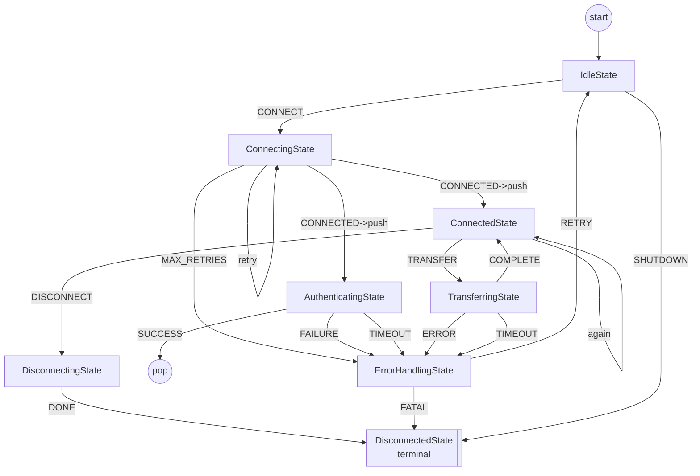
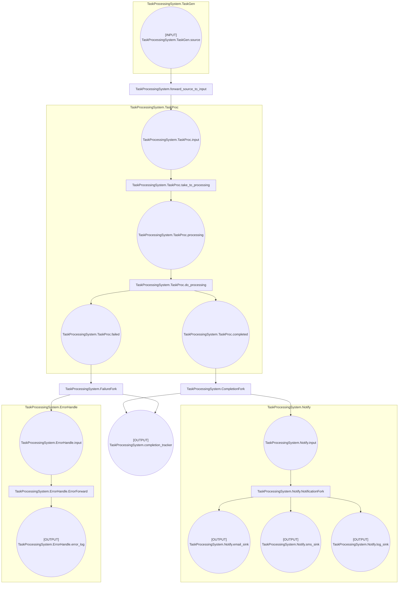
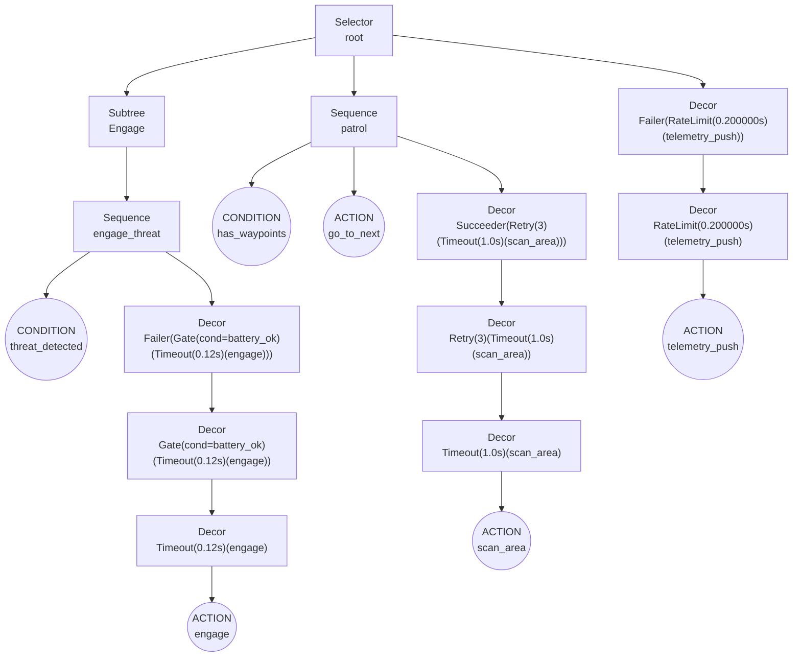

# Mycorrhizal

**Safe, structured, concurrent, event-driven systems in Python**

Mycorrhizal is a Python library providing four Domain-Specific Languages (DSLs) for building complex, type-safe, asynchronous systems. Whether you need finite state machines, workflow orchestration, behavior trees, or event logging, Mycorrhizal provides composable, decorator-based APIs that make concurrent programming approachable and correct.

## Quick Start

```bash
# Install
pip install mycorrhizal

# Or with uv
uv pip install mycorrhizal
```

## The Four DSLs

### 🔀 Septum - Finite State Machines

Asyncio-friendly FSM framework with decorator-based state definitions, timeout handling, and hierarchical composition.

**Best for**: State-driven systems, protocols, workflows with clear states

```python
from mycorrhizal.septum import septum, StateMachine

@septum.state(config=StateConfiguration(timeout=5.0))
def ProcessingState():
    @septum.on_state
    async def process(ctx):
        return ProcessingState.Events.COMPLETE

fsm = StateMachine(initial_state=ProcessingState)
await fsm.initialize()
await fsm.run()
```

**[Learn more →](septum/index.md)**

### 🔗 Hypha - Petri Nets

Colored Petri Net framework for workflow modeling with places, transitions, and token-based execution.

**Best for**: Workflow orchestration, parallel processing, resource management

```python
from mycorrhizal.hypha.core import pn, PlaceType, Runner

@pn.net
def ProcessingNet(builder: pn.NetBuilder):
    @builder.place(type=PlaceType.QUEUE)
    def tasks(bb): ...

    @builder.transition()
    async def process(tasks: List, bb): ...

runner = Runner(ProcessingNet)
await runner.run(blackboard)
```

**[Learn more →](hypha/index.md)**

### 🌳 Rhizomorph - Behavior Trees

Async behavior tree framework for decision-making and control logic with composable nodes and type-safe references.

**Best for**: AI, game AI, reactive systems, decision logic

```python
from mycorrhizal.rhizomorph import bt, Runner, Status

@bt.tree
def ThreatResponse():
    @bt.root
    @bt.sequence
    def root():
        yield threat_detected
        yield engage_threat
        yield return_to_base

runner = Runner(ThreatResponse())
await runner.run(blackboard)
```

**[Learn more →](rhizomorph/index.md)**

### 🍄 Spores - Event & Object Logging

OCEL-compatible event and object logging system for observability and auditing of distributed systems.

**Best for**: Observability, auditing, debugging distributed systems

```python
from mycorrhizal.spores import configure, get_spore_sync
from mycorrhizal.spores.models import SporesAttr

configure(transport=SyncFileTransport("logs/ocel.jsonl"))
spore = get_spore_sync(__name__)

@spore.log_event(
    event_type="OrderCreated",
    relationships={"order": ("return", "Order")},
)
def create_order(items):
    return Order(items=items)
```

**[Learn more →](spores/index.md)**

## Shared Infrastructure

All four DSLs are built on common abstractions:

- **Blackboard Pattern**: Type-safe shared state via Pydantic BaseModel
- **Timebase**: Abstract time (WallClock, MonotonicClock, CycleClock, DictatedClock)
- **Interface System**: Declarative access control for shared state
- **Async-First**: Built on asyncio throughout

## Which DSL Should I Use?

| Need | Use This DSL |
|------|---------------|
| State machines with timeouts and transitions | **Septum** |
| Workflow orchestration with parallel tasks | **Hypha** |
| Decision-making and reactive behavior | **Rhizomorph** |
| Event logging and observability | **Spores** |
| Multiple of the above | **Combine them!** |

## Key Features

### Visualize Before You Run

All four DSLs support **Mermaid diagram export** - visualize your state machines, Petri nets, and behavior trees **before execution** to catch structural issues early.

```python
# Export to Mermaid for visualization
fsm = StateMachine(initial_state=MyState)
await fsm.initialize()
mermaid = to_mermaid(fsm)  # Septum FSM
print(mermaid)  # Copy-paste into Mermaid Live Editor or docs
```

This static analysis capability helps you:

- Verify program structure without runtime execution
- Document system architecture automatically
- Review complex flows with diagrams
- Catch unreachable states or disconnected nodes

#### Finite State Machine (Septum)

A realistic network protocol FSM demonstrating timeout handling, retry logic, and push/pop for nested states:



This FSM from `examples/septum/network_protocol_fsm.py` demonstrates a production-ready network protocol pattern:
- **8 states** modeling a full connection lifecycle (idle, connecting, authenticating, connected, transferring, error handling, disconnecting, disconnected)
- **Timeouts** on connection (3s), authentication (2s), and transfer (5s)
- **Retry logic** with configurable attempts and exponential backoff support
- **Push/pop** for nested protocol states (authentication and transfer states pushed onto stack)
- **Error handling** with centralized error state and recovery or fatal escalation
- **Self-loop transitions** for heartbeat and dwell states
- **Graceful shutdown** sequence through disconnecting to terminal disconnected state
- **Message-based transitions** responding to async events (connect, transfer, disconnect, shutdown)

#### Petri Net (Hypha)

A task processing workflow with parallel notifications and error handling:



#### Behavior Tree (Rhizomorph)

A threat response system with selector logic, decorators, and subtrees:



### Additional Features

- **Type-Safe**: Full type hints with Pydantic and runtime checking
- **Async-First**: Built on asyncio for concurrent operations
- **Composable**: All DSLs work together via shared blackboard and timebase
- **Decorator-Based**: Clean, declarative syntax for defining structure
- **Well-Tested**: Comprehensive test coverage with pytest

## Installation

```bash
# Standard installation
pip install mycorrhizal

# With uv (recommended)
uv pip install mycorrhizal

# Development installation
git clone https://github.com/Jeff-Ciesielski/mycorrhizal
cd mycorrhizal
uv pip install -e ".[dev]"
```

**Requires**: Python 3.10+

## Getting Started

New to Mycorrhizal? Start with our tutorials:

1. [Installation](getting-started/installation.md)
2. [Your First Septum FSM](getting-started/your-first-septum.md)
3. [Your First Hypha Petri Net](getting-started/your-first-hypha.md)
4. [Your First Rhizomorph BT](getting-started/your-first-rhizomorph.md)
5. [Your First Spores Logger](getting-started/your-first-spores.md)

## Examples

The [examples/](https://github.com/Jeff-Ciesielski/mycorrhizal/tree/main/examples) directory contains working examples for each DSL:

- [`examples/septum/`](https://github.com/Jeff-Ciesielski/mycorrhizal/tree/main/examples/septum) - FSM examples
- [`examples/hypha/`](https://github.com/Jeff-Ciesielski/mycorrhizal/tree/main/examples/hypha) - Petri net examples
- [`examples/rhizomorph/`](https://github.com/Jeff-Ciesielski/mycorrhizal/tree/main/examples/rhizomorph) - Behavior tree examples
- [`examples/spores/`](https://github.com/Jeff-Ciesielski/mycorrhizal/tree/main/examples/spores) - Logging examples

Run any example:
```bash
uv run python examples/septum/septum_decorator_basic.py
```

## Documentation

- **[Guides](guides/)** - In-depth documentation on blackboards, timebases, composition, and best practices
- **[API Reference](api/)** - Complete API documentation for all modules
- **[Examples](examples/)** - Working code examples demonstrating each DSL

## Contributing

Contributions are welcome! Please see our repository for more information.

## License

This project is licensed under the MIT License - see the LICENSE file for details.
