# BT-to-PN Compiler

The BT-to-PN compiler is an experiment in petri nets as a universal substrate for executing structured programs.  THis compiler transforms Rhizomorph behavior trees into Hypha Petri nets for execution. This enables you to define behavior trees using the familiar BT syntax, then compile them to Petri nets for execution.

## Overview

The compiler is part of the Mycelium unified orchestration layer. It provides:

- **Seamless compilation**: Define BTs normally, compile to PN with one function call
- **Configurable timing**: Control RUNNING retry delays and Retry decorator timing
- **Peephole optimization**: Automatically eliminates unnecessary forward transitions
- **Full BT support**: Actions, conditions, composites, decorators, and more

## Quick Start

```python
from mycorrhizal.mycelium import compile_bt_to_pn, PNRunner
from mycorrhizal.rhizomorph.core import bt, Status
from mycorrhizal.common.timebase import MonotonicClock

# Define a behavior tree
@bt.tree
def MyBehaviorTree():
    @bt.action
    async def process(bb):
        # Do work
        return Status.SUCCESS

    @bt.root
    @bt.sequence
    def root():
        yield process

# Compile to Petri net
pn_spec = compile_bt_to_pn(MyBehaviorTree, name="MyBT")

# Run using the PN runner
class Blackboard:
    pass

bb = Blackboard()
timebase = MonotonicClock()
runner = PNRunner(pn_spec, blackboard=bb)

await runner.start(timebase)
```

## Compilation Strategy

The compiler transforms each BT node into a Petri net subnet with:

- **Entry place**: Receives tick tokens
- **success_exit**: Emits on SUCCESS
- **failure_exit**: Emits on FAILURE
- **running_exit**: Emits on RUNNING (optional for some nodes)

### Colored Token Model

The compiler uses colored tokens to carry state through the net:

```python
@dataclass(frozen=True)
class StatusToken:
    status: Status  # SUCCESS, FAILURE, or RUNNING
    data: Any = None
    attempts_remaining: int = 0  # For Retry decorator
    last_start_time: float = 0.0  # For RateLimit
    next_allowed_time: float = 0.0  # For RateLimit
```

### Peephole Optimization

After compilation, the optimizer eliminates "pure forward" transitions:

- Exactly one input place and one output place
- Passes token through unchanged (identity transformation)
- No delay (`delay=0`)
- No guard function
- Output place has consumers (not an external output)

The optimizer runs iteratively until no more optimizations are possible, handling chains of forward transitions.

## Node Transformations

### Leaf Nodes

#### Action

An action executes and returns SUCCESS, FAILURE, or RUNNING.

**BT Semantics:**

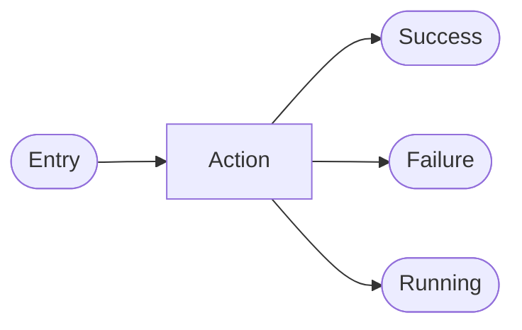

**PN Transformation:**

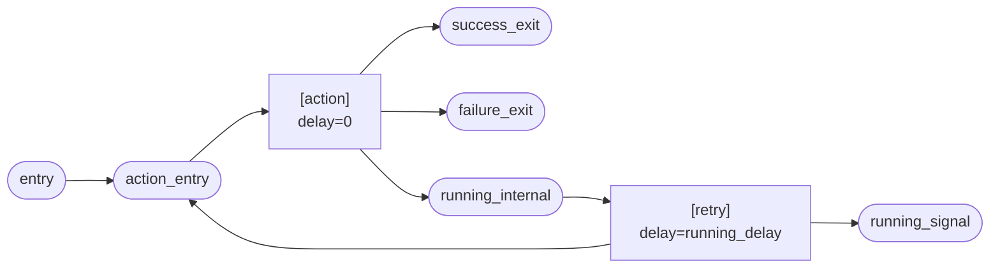

**Note:**

- RUNNING tokens go to `running_internal` which loops back via a timed retry transition
- The retry delay (default 0.1s) prevents hot loops
- `running_signal` propagates RUNNING status to parent nodes

#### Condition

A condition evaluates and returns SUCCESS or FAILURE.

**BT Semantics:**

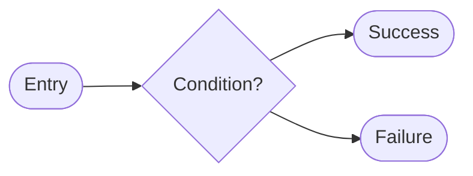

**PN Transformation:**

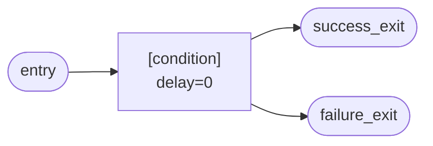

**Note:**

- Conditions are synchronous and always return immediately
- No RUNNING state, so no retry loop needed
- Compiled identically to actions but without the RUNNING path

### Composites

#### Sequence

Execute children in order. Succeed if all succeed, fail if any fail.

**BT Semantics:**

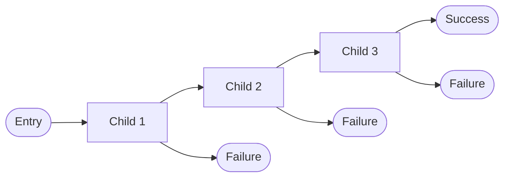

**PN Transformation (after optimization):**

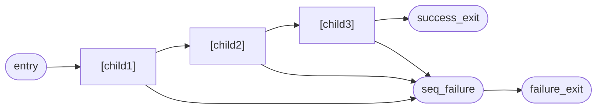

**Note:**

- Child successes chain directly to next child
- Child failures route directly to shared `seq_failure` place
- Peephole optimizer eliminates internal forward transitions
- Final emit transitions to external outputs are preserved

#### Selector

Try children in order. Succeed if any succeed, fail if all fail.

**BT Semantics:**

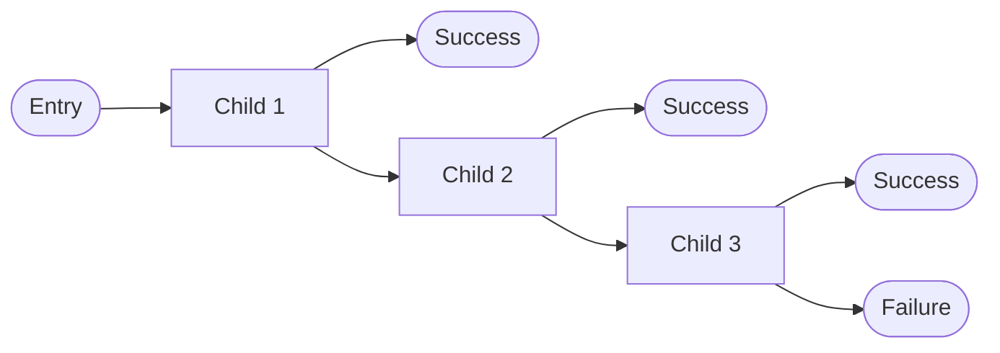

**PN Transformation (after optimization):**

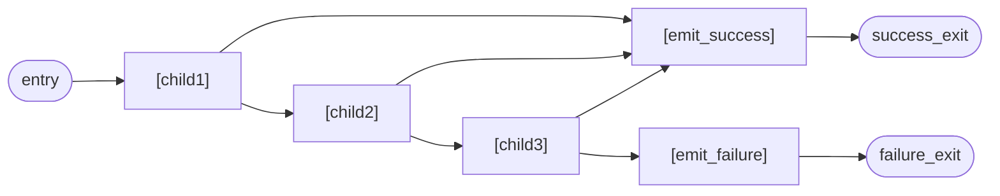

**Note:**

- Child successes route to shared emit_success transition (short-circuit)
- Child failures chain directly to next child
- Selector fails only when all children fail

#### Parallel

Execute all children concurrently. Succeed if >= success_threshold succeed.

**BT Semantics:**

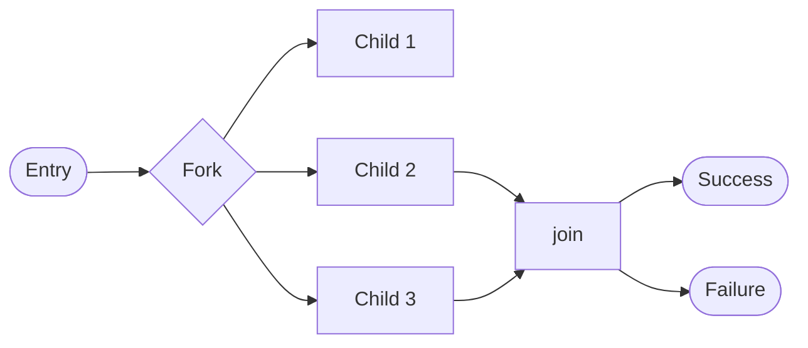

**PN Transformation:**

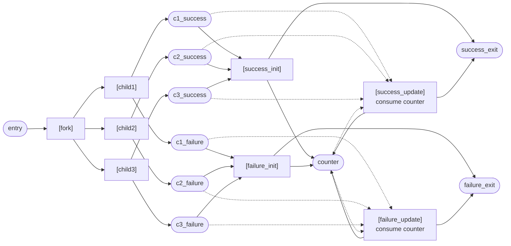

**Note:**

- Fork transition creates tokens for all children simultaneously
- **Dual-transition pattern** for threshold counting:
  - **_init transitions** (solid arrows): Handle first completion, initialize counter
  - **_update transitions** (dashed arrows): Handle subsequent completions, update count
- `ParallelCounterToken` carries `success_count`, `failure_count`, `total_children`, `success_threshold`
- Success when `success_count >= success_threshold`
- Failure when `failure_count > (total_children - success_threshold)` (can't reach threshold anymore)
- Counter serialization (via consume+produce) ensures no race conditions in count updates

### Decorators

#### Inverter

Invert child's result (SUCCESS <-> FAILURE).

**BT Semantics:**

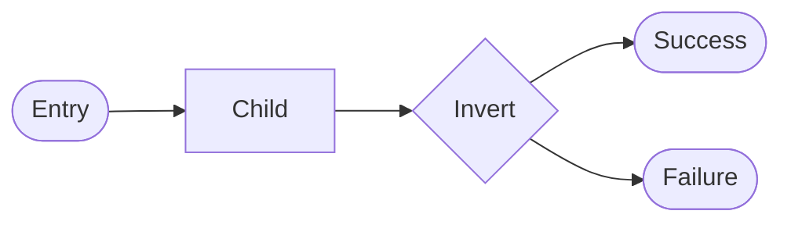

**PN Transformation (after optimization):**

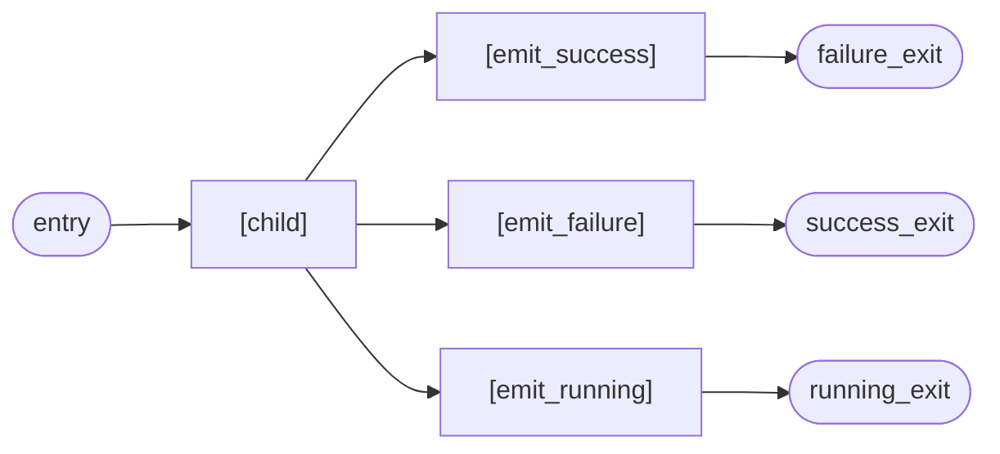

**Note:**

- Child's success routes to emit_failure (swapped)
- Child's failure routes to emit_success (swapped)
- Child's running passes through to emit_running

#### Retry

Retry failing child up to N times.

**BT Semantics:**

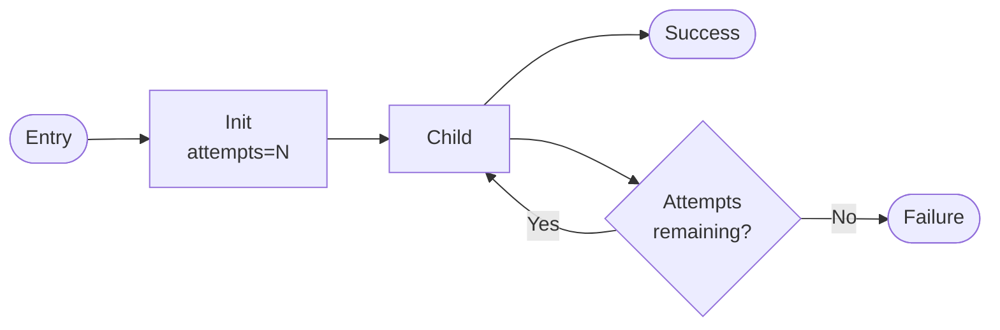

**PN Transformation:**

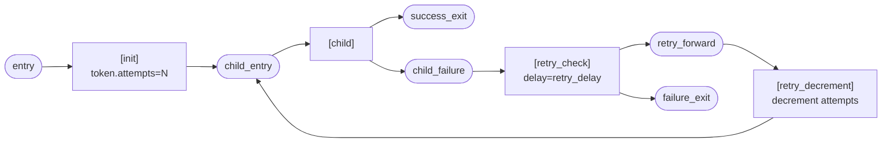

**Note:**

- `init` transition sets `attempts_remaining` on the token
- On failure, `retry_check` examines the count and routes based on the guard
- If attempts remain: routes to `retry_forward` place, then through decrement transition back to child
- If no attempts: routes directly to failure exit
- `retry_delay` controls pause between attempts (default 0.0)

#### Timeout

Fail if child doesn't complete within N seconds.

**BT Semantics:**

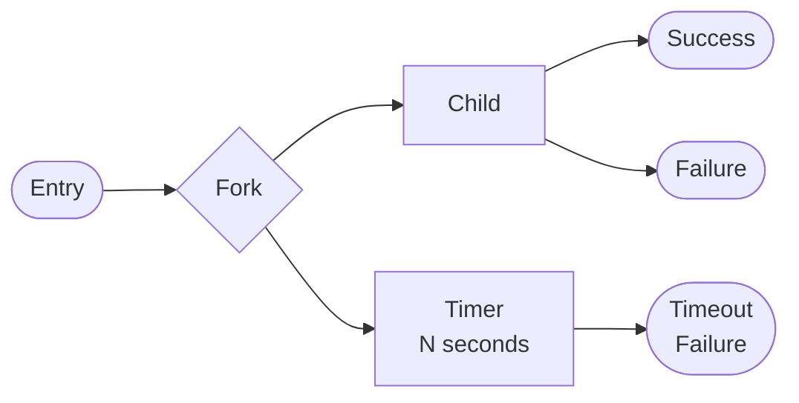

**PN Transformation:**

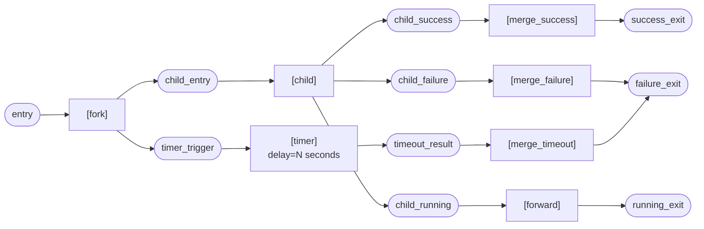

**Note:**

- Fork creates tokens for both child and timer
- Timer transition has `delay=N` seconds
- THREE separate merge transitions handle each race outcome independently:
  - `merge_success`: child succeeded first -> SUCCESS
  - `merge_failure`: child failed first -> FAILURE
  - `merge_timeout`: timer fired first -> FAILURE (timeout)
- RUNNING propagates through (timeout doesn't cancel in-progress work)
- No deadlock: each merge transition fires independently when its input place has a token

#### Succeeder

Always return SUCCESS regardless of child's result.

**BT Semantics:**

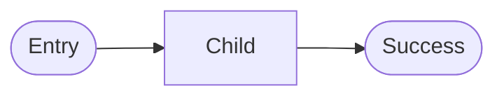

**PN Transformation (after optimization):**

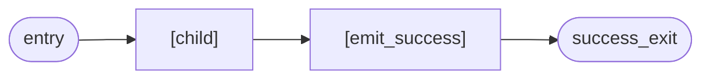

**Note:**

- All child outputs (success, failure, running) route to emit_success
- Used for "fire and forget" actions where outcome doesn't matter
- RUNNING from child is converted to SUCCESS

#### Failer

Always return FAILURE regardless of child's result.

**BT Semantics:**

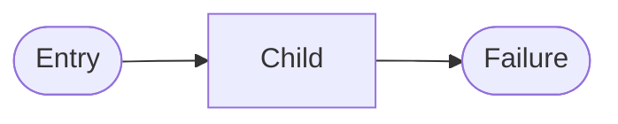

**PN Transformation (after optimization):**

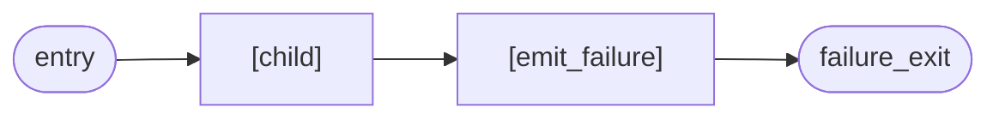

**Note:**

- All child outputs (success, failure, running) route to emit_failure
- Used for testing failure handling or forcing fallback paths
- RUNNING from child is converted to FAILURE

#### Gate

Guard child with condition. Only execute if condition succeeds.

**BT Semantics:**

```mermaid
flowchart LR
    entry([Entry]) --> cond{"Condition?"}
    cond -->|Success| child["Child"]
    cond -->|Failure| fail([Failure])
    child --> result([Result])
```

**PN Transformation (after optimization):**

```mermaid
flowchart LR
    entry([entry]) --> condition["[condition]"]
    condition --> child["[child]"]
    condition --> emit_f["[emit_failure]"]

    child --> emit_s["[emit_success]"]
    child --> emit_f
    child --> emit_r["[emit_running]"]

    emit_s --> success([success_exit])
    emit_f --> failure([failure_exit])
    emit_r --> running([running_exit])
```

**Note:**

- Condition is evaluated first
- If condition succeeds: execute child, return its result
- If condition fails: return FAILURE via emit_failure (gate closed)
- If condition running: return RUNNING via emit_running

#### When

Optional step. Skip (return SUCCESS) if condition fails.

**BT Semantics:**

```mermaid
flowchart LR
    entry([Entry]) --> cond{"Condition?"}
    cond -->|Success| child["Child"]
    cond -->|Failure| skip([Success])
    child --> result([Result])
```

**PN Transformation (after optimization):**

```mermaid
flowchart LR
    entry([entry]) --> condition["[condition]"]
    condition --> child["[child]"]
    condition --> emit_s["[emit_success]"]

    child --> emit_s
    child --> emit_f["[emit_failure]"]
    child --> emit_r["[emit_running]"]

    emit_s --> success([success_exit])
    emit_f --> failure([failure_exit])
    emit_r --> running([running_exit])
```

**Note:**

- Like Gate, but condition FAILURE routes to emit_success (skip)
- Used for optional steps in sequences
- "If condition, do this; otherwise skip"

#### TryCatch

Try block first, catch on failure.

**BT Semantics:**

```mermaid
flowchart LR
    entry([Entry]) --> try_block["Try"]
    try_block --> success([Success])
    try_block --> catch_block["Catch"]
    catch_block --> success2([Success])
    catch_block --> failure([Failure])
```

**PN Transformation (after optimization):**

```mermaid
flowchart LR
    entry([entry]) --> try_block["[try_block]"]
    try_block --> emit_s["[emit_success]"]
    try_block --> catch_block["[catch_block]"]

    catch_block --> emit_s
    catch_block --> emit_f["[emit_failure]"]

    emit_s --> success([success_exit])
    emit_f --> failure([failure_exit])
```

**Note:**

- Try executes first
- If try succeeds: return SUCCESS via emit_success
- If try fails: execute catch block
- Returns SUCCESS if either succeeds, FAILURE if both fail

#### RateLimit

Throttle child starts to once per period.

**BT Semantics:**

```mermaid
flowchart LR
    entry([Entry]) --> check{"Time<br/>check"}
    check -->|Allowed| child["Child"]
    check -->|Too soon| wait([Running])
    child --> result([Result])
```

**PN Transformation:**

```mermaid
flowchart LR
    entry([entry]) --> rate_check["[rate_limit_check]"]
    rate_check --> child["[child]"]
    rate_check --> waiting([waiting])

    child --> child_s([child_success])
    child --> child_f([child_failure])
    child --> child_r([child_running])

    child_s --> emit_s["[emit_success]"]
    emit_s --> success([success_exit])
    child_f --> emit_f["[emit_failure]"]
    emit_f --> failure([failure_exit])
    child_r --> emit_r["[emit_running]"]
    emit_r --> running([running_exit])

    waiting --> retry["[rate_limit_waiting_retry]<br/>delay=running_delay"]
    retry --> child
    retry --> waiting
```

**Note:**

- Token carries `last_start_time` and `next_allowed_time`
- `rate_check` compares current time vs last start + period
- If allowed: execute child directly
- If too soon: go to waiting place, retry after delay
- RUNNING child passes through without throttling (no starvation)

#### DoWhile

Loop while condition is true.

**BT Semantics:**

```mermaid
flowchart LR
    entry([Entry]) --> cond{"Condition?"}
    cond -->|False| success([Success])
    cond -->|True| child["Child"]
    child -->|Success| cond
    child -->|Failure| failure([Failure])
```

**PN Transformation:**

```mermaid
flowchart LR
    entry([entry]) --> init["[init]<br/>iteration_count=0"]
    init --> condition_entry([condition_entry])
    condition_entry --> condition["[condition]"]

    condition --> dispatcher["[dispatcher]"]
    dispatcher --> child_entry([child_entry])
    condition --> emit_s["[emit_success]"]
    condition --> emit_r["[emit_running]"]

    child_entry --> child["[child]"]
    child --> loop_back["[loop_back]<br/>delay=running_delay"]
    loop_back --> condition_entry
    loop_back --> emit_r

    child --> emit_f["[emit_failure]"]
    child --> emit_r

    emit_s --> success([success_exit])
    emit_f --> failure([failure_exit])
    emit_r --> running([running_exit])
```

**Note:**

- Check condition first
- If false: return SUCCESS via emit_success (loop complete)
- If true: execute child directly
  - Child success: loop back to condition via RUNNING break
  - Child failure: return FAILURE via emit_failure (loop aborted)
  - Child running: propagate RUNNING via emit_running
- The RUNNING break after child success prevents infinite loops within one tick
- loop_back produces TWO tokens simultaneously:
  1. Token to `condition_entry` to continue the loop
  2. Token to `running_exit` to propagate RUNNING status to parent

#### Match

Pattern-matching dispatch based on key function.

**BT Semantics:**

```mermaid
flowchart LR
    entry([Entry]) --> dispatch{"Dispatch"}
    dispatch -->|"case_1"| case1["Case 1"]
    dispatch -->|"case_2"| case2["Case 2"]
    dispatch -->|"default"| default["Default"]
    case1 --> result([Result])
    case2 --> result
    default --> result
```

**PN Transformation:**

```mermaid
flowchart LR
    entry([entry]) --> dispatch["[match_dispatch]"]
    dispatch --> case1_entry([case_1_entry])
    dispatch --> case2_entry([case_2_entry])
    dispatch --> no_match([no_match])

    case1_entry --> case1["[case_1]"]
    case1 --> emit_s["[emit_success]"]
    case1 --> emit_f["[emit_failure]"]
    case1 --> emit_r["[emit_running]"]

    case2_entry --> case2["[case_2]"]
    case2 --> emit_s
    case2 --> emit_f
    case2 --> emit_r

    emit_s --> success([success_exit])
    emit_f --> failure([failure_exit])
    emit_r --> running([running_exit])

    no_match --> emit_f
```

**Note:**

- `match_dispatch` evaluates `key_fn(bb)` and checks matchers in order
- Matchers: type (isinstance), predicate callable, value equality, or default
- `MatchToken` carries `matched_case_idx` and `key_value` for memory
- First tick: evaluate key_fn, find matching case, route to that case
- Subsequent ticks: route directly to previously matched case (memory semantics)
- No match + no default -> FAILURE
- Child SUCCESS/FAILURE resets memory for next fresh tick

### Special Constructs

#### Subtree

Reference to another tree.

**BT Semantics:**

```mermaid
flowchart LR
    entry([Entry]) --> subtree["Subtree<br/>(MyOtherTree)"]
    subtree --> success([Success])
    subtree --> failure([Failure])
```

**PN Transformation (after optimization):**

```mermaid
flowchart LR
    entry([entry]) --> inlined_contents["[inlined subtree<br/>contents]"]
    inlined_contents --> subtree_s(["subtree_success"])
    inlined_contents --> subtree_f(["subtree_failure"])

    subtree_s --> emit_s["[emit_success]"]
    emit_s --> success([success_exit])

    subtree_f --> emit_f["[emit_failure]"]
    emit_f --> failure([failure_exit])
```

**Note:**

- Subtrees are fully inlined during compilation
- No separate net boundary - everything becomes one flat net
- Maintains semantic equivalence
- Peephole optimizer eliminates intermediate entry places and forward transitions

## API Reference

### `compile_bt_to_pn`

Compile a behavior tree to a Petri net specification.

```python
compile_bt_to_pn(
    tree: Any,
    name: str = "CompiledBT",
    running_delay: float = 0.1,
    retry_delay: float = 0.0
) -> NetSpec
```

**Parameters:**

- `tree`: The behavior tree to compile (a @bt.tree decorated function)
- `name`: Name for the compiled Petri net (default: "CompiledBT")
- `running_delay`: Delay between RUNNING retry attempts in seconds (default: 0.1)
- `retry_delay`: Delay between Retry decorator attempts in seconds (default: 0.0)

**Returns:**

- `NetSpec` that can be executed by Hypha's PNRunner

**Example:**

```python
from mycorrhizal.mycelium import compile_bt_to_pn
from mycorrhizal.rhizomorph.core import bt

@bt.tree
def MyBT():
    # ... define tree
    pass

# Compile with custom delays
pn_spec = compile_bt_to_pn(
    MyBT,
    name="CustomNet",
    running_delay=0.05,  # Faster RUNNING retries
    retry_delay=1.0      # 1 second between Retry attempts
)
```

### `BTtoPNCompiler`

Low-level compiler class for advanced usage.

```python
from mycorrhizal.mycelium.bt_compiler import BTtoPNCompiler

compiler = BTtoPNCompiler(
    name="MyNet",
    running_delay=0.1,
    retry_delay=0.0
)
pn_spec = compiler.compile(tree_spec)
```

## Configuration

### Timing Parameters

**`running_delay`**: Delay between RUNNING retry attempts (default: 0.1 seconds)

- Prevents hot loops when actions return RUNNING
- Lower values = faster response but more CPU usage
- Higher values = less CPU but slower RUNNING propagation

**`retry_delay`**: Delay between Retry decorator attempts (default: 0.0 seconds)

- Controls pause between retry attempts
- Set to 0 for immediate retries
- Set > 0 for backoff behavior

### Optimization

The peephole optimizer runs automatically after compilation. It eliminates:

- Pure forward transitions (1 input, 1 output, delay=0, no guard)
- Intermediate places that only forward tokens
- Unnecessary emit transitions

The optimization is iterative and continues until no more optimizations are possible.

## Usage Patterns

### Direct Execution

Execute a compiled BT directly using the PN runner:

```python
pn_spec = compile_bt_to_pn(MyBT)
runner = PNRunner(pn_spec, blackboard=bb)
await runner.start(timebase)
```

### Integration with Mycelium

Combine compiled BTs with FSMs and PNs in Mycelium:

```python
# Compile BT to PN for integration
pn_spec = compile_bt_to_pn(MyBT)

# Use in a larger Mycelium system
@pn_net
def HybridSystem(builder):
    input_q = builder.place("input")
    output_q = builder.place("output")

    @builder.transition(bt=MyBT, outputs=[output_q])
    async def process(consumed, bb, timebase):
        pass  # BT handles routing

    builder.arc(input_q, process)
    builder.arc(process, output_q)
```

### Diagnostics

Generate Mermaid diagrams of compiled nets:

```python
pn_spec = compile_bt_to_pn(MyBT)
mermaid = pn_spec.to_mermaid()
print(mermaid)
```

## Implementation Notes

### Correctness Guarantees

The compiler ensures:

- **No token loss**: All outputs route to appropriate places
- **No deadlock**: All converge paths have multiple merge transitions
- **Semantic equivalence**: Compiled PN behaves identically to source BT
- **No race conditions**: Counter updates are serialized via consume+produce pattern

### Performance Considerations

- **Peephole optimization**: Reduces net size by eliminating unnecessary transitions
- **Counter serialization**: Ensures correct counting without locks
- **Lazy evaluation**: Transitions fire only when tokens are available
- **Timing control**: Delays prevent hot loops and enable backoff

### Limitations

- **Subtree inlining**: Large subtrees increase net size linearly
- **Counter memory**: Parallel nodes with many children create larger counter tokens
- **No pruning**: The compiler doesn't prune unreachable code (unlike some BT runtimes)

## See Also

- [Mycelium Overview](index.md) - Unified orchestration layer
- [BT-in-PN Pattern](bt-in-pn.md) - Using BTs in Petri net transitions
- [Rhizomorph Documentation](../rhizomorph/index.md) - Behavior tree DSL
- [Hypha Documentation](../hypha/index.md) - Petri net DSL
