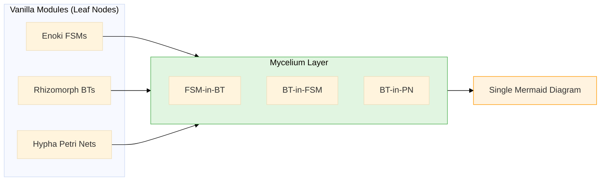
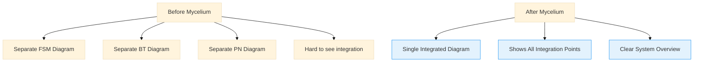

# Mycelium

Mycelium is the unified orchestration layer for Mycorrhizal that enables seamless interoperability between finite state machines (Enoki), behavior trees (Rhizomorph), and Petri nets (Hypha). With Mycelium, you can nest these systems arbitrarily to build sophisticated, event-driven architectures.

## What is Mycelium?

Mycelium provides:

- **Arbitrary nesting**: Combine FSMs, behavior trees, and Petri nets in any configuration
- **Bidirectional FSM-BT integration**: Use FSMs inside BT actions, or BTs inside FSM states
- **BT-in-PN integration**: Run behavior trees as part of Petri net transitions
- **Seamless visualizations**: Single Mermaid diagrams show your entire integrated system
- **Unified imports**: Import everything from `mycorrhizal.mycelium` for a consistent API

### The Leaf Node Concept

Vanilla Enoki FSMs, Rhizomorph behavior trees, and Hypha Petri nets serve as "leaf nodes" in the Mycelium system. You maintain a library of interesting FSMs/BTs/PNs (a "model zoo"), then integrate them into Mycelium using wrapper patterns:



**Key principle:** Once you're inside the Mycelium layer, stay in Mycelium for further nesting. Don't wrap a Mycelium-integrated FSM back into vanilla Enoki - just add more Mycelium integration.

## Why Mycelium?

### Arbitrary Nesting

Mycelium breaks down the barriers between different orchestration paradigms:

- **FSM-in-BT**: Behavior tree controls when an FSM transitions between states
- **BT-in-FSM**: FSM state uses a behavior tree for complex decision-making
- **BT-in-PN**: Petri net transition runs a behavior tree to process tokens
- **Deep nesting**: Combine patterns freely (e.g., BT-in-FSM-in-BT)

### Seamless Visualizations

This is a critical advantage of Mycelium. With vanilla modules, you'd need separate diagrams for each system. Mycelium generates **single integrated Mermaid diagrams** that show:

- Behavior trees with FSM states embedded in actions
- FSMs with BT decision trees embedded in states
- Petri nets with BT logic embedded in transitions
- Multi-level nesting with clear integration points



### Canonical Usage Pattern

Mycelium is designed to be the **canonical way** to design FSMs, BTs, and Petri nets in Mycorrhizal. The vanilla modules serve primarily as runtimes for Mycelium implementations.

## Quick Example

Here's a minimal FSM-in-BT integration. A behavior tree controls an FSM that manages robot states:

```python
from mycorrhizal.mycelium import (
    tree, Action, Sequence, root,
    state, events, on_state, transitions, LabeledTransition,
    TreeRunner,
)
from mycorrhizal.rhizomorph.core import bt, Status
from enum import Enum, auto
from pydantic import BaseModel

# Define FSM states using mirrored Enoki API
@state()
def IdleState():
    @events
    class Events(Enum):
        START = auto()
        STOP = auto()

    @on_state
    async def on_state(ctx, bb):
        print(f"FSM in {IdleState.__name__}")
        return None

    @transitions
    def transitions():
        return []

@state()
def WorkingState():
    @events
    class Events(Enum):
        PAUSE = auto()
        DONE = auto()

    @on_state
    async def on_state(ctx, bb):
        print(f"FSM in {WorkingState.__name__}")
        bb.tasks_completed += 1
        return None

    @transitions
    def transitions():
        return []

# Define BT with FSM-integrated action
@tree
def RobotController():
    @Action(fsm=IdleState)
    async def start_work(bb, tb, fsm_runner):
        """FSM auto-ticks, BT controls transitions."""
        state_name = fsm_runner.current_state.name
        print(f"BT: FSM is in {state_name}")

        if bb.tasks_completed >= 3:
            return Status.SUCCESS  # Done

        # Transition FSM to working state
        fsm_runner.send_message(IdleState.Events.START)
        return Status.SUCCESS

    @Action(fsm=WorkingState)
    async def do_work(bb, tb, fsm_runner):
        """Process tasks in working state."""
        print(f"BT: Processing task {bb.tasks_completed}")
        fsm_runner.send_message(WorkingState.Events.PAUSE)
        return Status.SUCCESS

    @root
    @Sequence
    def control_loop(N):
        yield N.start_work
        yield N.do_work

# Run it
class Blackboard(BaseModel):
    tasks_completed: int = 0

async def main():
    bb = Blackboard()
    runner = TreeRunner(RobotController, bb=bb)

    for _ in range(3):
        await runner.tick()
        await asyncio.sleep(0.1)

    # Generate diagram showing BT with embedded FSM states
    print(runner.tree.to_mermaid())

import asyncio
asyncio.run(main())
```

Output:
```
BT: FSM is in IdleState
FSM in IdleState
BT: Processing task 1
FSM in WorkingState
BT: FSM is in IdleState
FSM in IdleState
...
```

The generated Mermaid diagram shows the BT structure with FSM states labeled directly in the action nodes - a single, integrated view.

## Integration Patterns

Mycelium supports three primary integration patterns:

### FSM-in-BT (`@Action(fsm=...)`)

Use when a behavior tree needs to control an FSM's lifecycle:

- BT decides when FSM transitions occur
- FSM provides persistent state management
- Multiple FSMs can be coordinated by one BT
- **Example:** Robot controller with idle/working/charging states

**See:** [FSM-in-BT Pattern](fsm-in-bt.md)

### BT-in-FSM (`@state(bt=...)`)

Use when an FSM state needs complex decision-making:

- FSM manages workflow stages
- BT evaluates recovery strategies, routing decisions, etc.
- Each state can use different BTs
- **Example:** CI/CD pipeline with intelligent error recovery

**See:** [BT-in-FSM Pattern](bt-in-fsm.md)

### BT-in-PN (`@builder.transition(bt=...)`)

Use when a Petri net transition needs intelligent processing:

- PN structures workflow and data flow
- BT validates, enriches, and routes tokens
- Complex logic stays out of PN structure
- **Example:** Job queue with priority-based routing and validation

**See:** [BT-in-PN Pattern](bt-in-pn.md)

## When to Use Mycelium

Use Mycelium when:

- You need to combine different orchestration paradigms
- Your system has both stateful and decision-heavy components
- You want unified visualizations showing integration points
- You're building complex, event-driven architectures

Start with vanilla modules when:

- Learning individual systems (FSM, BT, or PN)
- Building simple, single-paradigm systems
- Prototyping without integration needs

## Next Steps

- **Tutorial:** [Your First Mycelium Tree](../getting-started/your-first-mycelium.md) - Step-by-step guide
- **Patterns:** Explore the three integration patterns (FSM-in-BT, BT-in-FSM, BT-in-PN)
- **Advanced:** Learn about [deep nesting strategies](advanced-patterns.md)
- **Visualizations:** See [seamless diagram examples](visualizations.md)
- **Spores:** Configure [event logging across nested systems](spores-integration.md)
