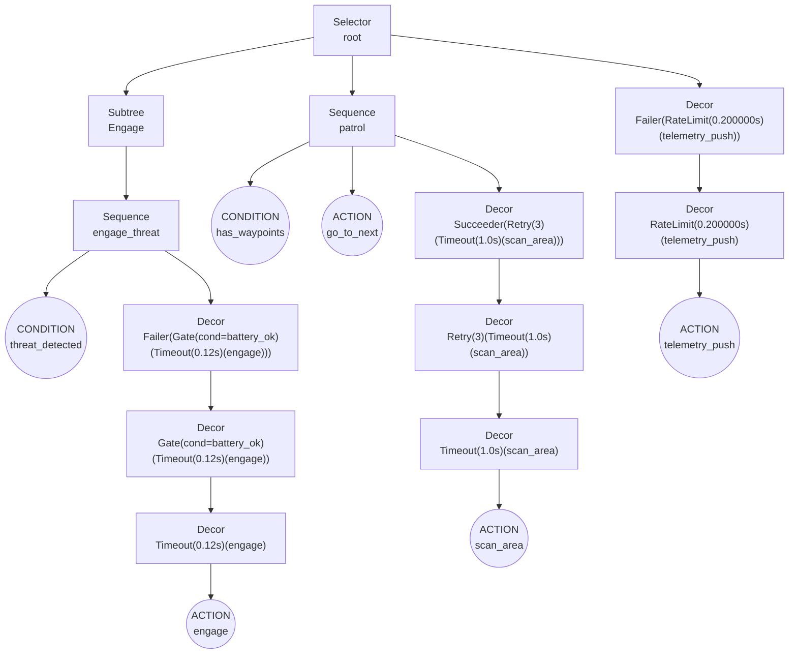

# Rhizomorph Behavior Trees

Rhizomorph is an async-first Behavior Tree DSL for decision-making and control logic.

## Overview

Rhizomorph Behavior Trees provide:

- **Decorator-based syntax** - Define trees, nodes, and composites with decorators
- **Async-first design** - Native asyncio support throughout
- **Type-safe references** - Owner-aware composition with direct name references
- **Modular subtrees** - Reusable tree components with `bt.subtree()`
- **Rich composites** - Sequence, selector, parallel, and more

## Quick Example

```python
from mycorrhizal.rhizomorph.core import bt, Runner as BTRunner, Status
from pydantic import BaseModel

class RobotContext(BaseModel):
    battery_level: int = 100
    has_task: bool = True

@bt.tree
class RobotAI:
    @bt.condition
    def has_battery(bb: RobotContext) -> bool:
        return bb.battery_level > 20

    @bt.action
    async def recharge(bb: RobotContext) -> Status:
        print("Recharging...")
        bb.battery_level = 100
        return Status.SUCCESS

    @bt.action
    async def do_task(bb: RobotContext) -> Status:
        if not bb.has_task:
            return Status.FAILURE
        print("Doing task!")
        bb.battery_level -= 10
        return Status.SUCCESS

    @bt.action
    async def idle(bb: RobotContext) -> Status:
        print("Idling...")
        return Status.SUCCESS

    @bt.root
    @bt.selector
    def root():
        """Try battery check, fall through to tasks, then idle."""
        yield has_battery
        yield do_task
        yield idle

    @bt.sequence
    def charging_sequence():
        """Battery must be low AND recharge succeeds."""
        yield has_battery  # Actually: check if LOW battery (negated)
        yield recharge
```

## Key Concepts

### Nodes

Behavior trees have three types of leaf nodes:

#### Actions

Perform operations and return status:

```python
@bt.action
async def my_action(bb: Blackboard) -> Status:
    # Do work
    result = do_something(bb)
    return Status.SUCCESS if result else Status.FAILURE
```

#### Conditions

Return boolean or status:

```python
@bt.condition
def my_condition(bb: Blackboard) -> bool:
    return bb.some_value > 10

# OR return Status directly
@bt.condition
def my_condition(bb: Blackboard) -> Status:
    return Status.SUCCESS if bb.ready else Status.FAILURE
```

#### Decorators

Modify node behavior:

```python
@bt.decorator
async def retry_decorator(child, bb, executor):
    """Retry child node up to 3 times."""
    for attempt in range(3):
        status = await executor(child)
        if status == Status.SUCCESS:
            return Status.SUCCESS
    return Status.FAILURE
```

### Composites

Composites control flow among child nodes:

#### Sequence

Execute children in order, fail fast:

```python
@bt.sequence
def my_sequence():
    """All children must succeed."""
    yield step_1  # Runs first
    yield step_2  # Runs only if step_1 succeeds
    yield step_3  # Runs only if step_2 succeeds
```

#### Selector

Execute children in order, succeed fast:

```python
@bt.selector
def my_selector():
    """Try each until one succeeds."""
    yield option_a  # Runs first
    yield option_b  # Runs only if option_a fails
    yield option_c  # Runs only if option_b fails
```

#### Parallel

Execute all children simultaneously:

```python
@bt.parallel
def my_parallel():
    """All children run concurrently."""
    yield task_a  # All run in parallel
    yield task_b
    yield task_c
```

### Conditional Wrappers

Control whether child nodes execute based on conditions:

#### gate

Execute child only when condition is true, otherwise return FAILURE:

```python
@bt.sequence
def gated_sequence():
    """Child must pass gate or sequence fails."""
    yield bt.gate(has_battery)(engage_action)
    yield next_step  # Only reached if gate passed
```

Use `gate` when a condition is **required** for execution.

#### when

Execute child only when condition is true, otherwise return SUCCESS (skip but continue):

```python
@bt.sequence
def feature_flag_sequence():
    """Optional action - sequence continues if feature is disabled."""
    yield validate_input
    yield bt.when(feature_enabled)(optional_action)
    yield continue_processing  # Always reached
```

Use `when` for **optional** steps or feature flags.

**When vs Gate:**

| Wrapper | Condition True | Condition False | Use Case |
|---------|---------------|-----------------|----------|
| `gate(cond)(child)` | Execute child | Return FAILURE | Required precondition |
| `when(cond)(child)` | Execute child | Return SUCCESS | Optional/feature flag |

### Root Node

Every tree must have a root:

```python
@bt.root
@bt.sequence
def root():
    """Entry point for the tree."""
    yield initialize
    yield process
    yield cleanup
```

## Status Values

Nodes return one of three statuses:

- **SUCCESS** - Node completed successfully
- **FAILURE** - Node failed (expected failure)
- **ERROR** - Unexpected error (aborts tree execution)

## Subtrees

Create reusable tree components with `bt.subtree()`:

```python
# Define a reusable subtree
@bt.tree
def NavigationSubtree():
    """Reusable navigation behavior."""
    @bt.action
    async def move_to_target(bb):
        print(f"Moving to {bb.target}")
        return Status.SUCCESS

    @bt.action
    async def avoid_obstacles(bb):
        print("Avoiding obstacles")
        return Status.SUCCESS

    @bt.root
    @bt.sequence
    def root():
        yield avoid_obstacles
        yield move_to_target

# Import and use the subtree in another tree
from other_module import NavigationSubtree

@bt.tree
def MainRobotAI():
    @bt.action
    async def check_battery(bb):
        return Status.SUCCESS if bb.battery > 20 else Status.FAILURE

    @bt.root
    @bt.sequence
    def root():
        yield check_battery
        yield bt.subtree(NavigationSubtree)  # Embed entire subtree
```

The subtree is mounted directly into the parent tree's structure.

## Blackboard Integration

Access shared state:

```python
from pydantic import BaseModel
from typing import Annotated

class GameContext(BaseModel):
    player_health: int = 100
    has_key: bool = False
    enemies_visible: int = 0

@bt.tree
class GameAI:
    @bt.condition
    def is_low_health(bb: GameContext) -> bool:
        return bb.player_health < 30

    @bt.action
    async def heal(bb: GameContext) -> Status:
        bb.player_health = min(100, bb.player_health + 20)
        return Status.SUCCESS
```

## Running Trees

Create a runner and tick the tree:

```python
# Create runner
bb = RobotContext()
tree = RobotAI()
runner = BTRunner(tree=tree, blackboard=bb)

# Tick the tree (one evaluation)
await runner.tick()

# Run multiple ticks
for _ in range(10):
    await runner.tick()
    await asyncio.sleep(0.1)
```

## Examples

- [Basic Example](../../examples/rhizomorph_example.py) - Simple behavior tree
- [Blended Demo](../../examples/blended_demo.py) - Behavior tree + Petri net

## Documentation

- [API Reference](../api/rhizomorph.md) - Complete API documentation
- [Getting Started](../getting-started/your-first-rhizomorph.md) - Tutorial
- [Composition](../guides/composition.md) - Subtree patterns

## Mermaid Export

### Visualize Before You Run

Rhizomorph behavior trees support **Mermaid diagram export for static verification**:

```python
tree = MyTree()
mermaid = tree.to_mermaid()
print(mermaid)
```

View in [Mermaid Live Editor](https://mermaid.live/) to visualize your decision logic.

**Benefits:**
- Verify all nodes are reachable from the root
- Understand the control flow (sequences, selectors, parallels)
- Identify potential logic errors in tree structure
- Validate composite node behavior
- Document AI/decision logic automatically

**Review and validate your decision trees before ticking them!**

### Example: Threat Response System

This behavior tree shows a threat response AI with patrol, engagement, and telemetry behaviors:



**Key features shown:**
- Selector root for priority-based behavior selection
- Subtree composition (Engage subtree)
- Decorator pattern usage (Gate, Timeout, Retry, RateLimit, Failer, Succeeder)
- Condition nodes for state checking
- Action nodes for executing behaviors
- Sequential and parallel flow control

See the [Rhizomorph Example](../../examples/rhizomorph/rhizomorph_example.py) for the complete executable example.

## See Also

- [Septum](../septum/) - State Machines for stateful behavior
- [Hypha](../hypha/) - Petri Nets for workflow orchestration
