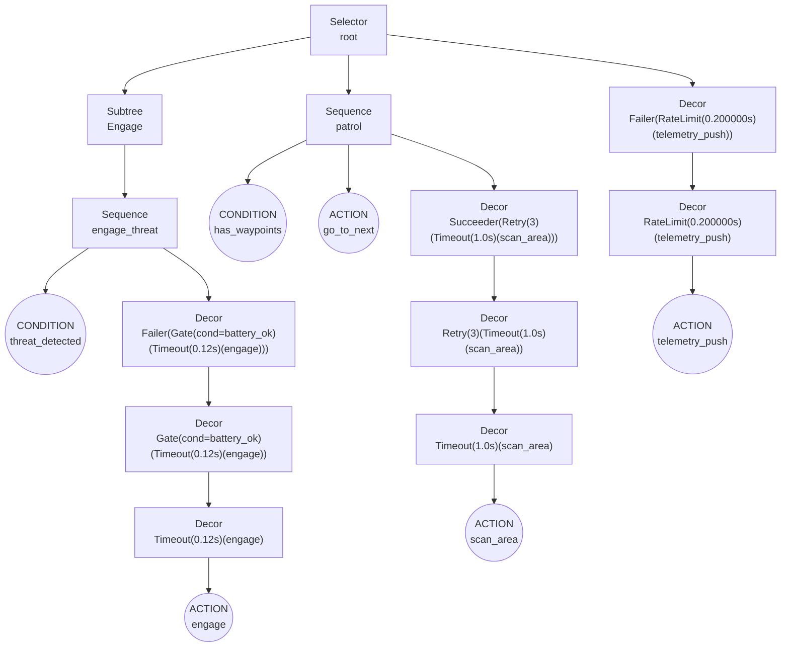

# Rhizomorph

Asyncio-friendly **Behavior Trees** for Python, designed for clarity, composability, and ergonomics in asynchronous systems.

- **Fluent decorator chains**: `bt.failer().gate(condition).timeout(0.5)(action)`
- **Owner-aware composites**: factories expand with the correct class owner, so large trees can be split across modules
- **Cross-tree composition**: embed full subtrees with `bt.subtree()`
- **Mermaid diagrams**: export static structure diagrams for documentation/debugging
- **Timebases**: simulate or control time with pluggable clocks (wall/UTC/monotonic/cycle/dictated)

---

## Quick Example
```python
from rhizomorph.core import bt, Runner, Status

class BB:
    def __init__(self, waypoints):
        self.waypoints = waypoints

@bt.tree
def Patrol():
    @bt.action
    async def go_to_next(bb):
        if bb.waypoints <= 0:
            return Status.SUCCESS
        bb.waypoints -= 1
        return Status.RUNNING if bb.waypoints > 0 else Status.SUCCESS

    @bt.condition
    def has_waypoints(bb):
        return getattr(bb, "waypoints", 0) > 0

    @bt.root
    @bt.sequence(memory=True)
    def root():
        yield has_waypoints
        yield bt.timeout(1.0)(go_to_next)

async def main():
    bb = BB(waypoints=3)
    runner = Runner(Patrol, bb=bb)
    while True:
        status = await runner.tick()
        print("Status:", status.name, "remaining:", bb.waypoints)
        if status in (Status.SUCCESS, Status.FAILURE):
            break
```

---

## Fluent Decorator Chains

Decorator wrappers are available via **fluent chains** that read left→right and apply to a child when called at the end:

```python
yield bt.failer().gate(battery_ok).timeout(0.25)(engage)
```

**Reads left→right:**

1. `failer()` → forces **FAILURE** once the child completes (whether the child succeeds or fails). While the child is RUNNING, RUNNING bubbles.
2. `gate(battery_ok)` → only ticks the child if `battery_ok` returns SUCCESS. If the condition returns RUNNING, the whole gate is RUNNING. If it returns FAILURE, the gate returns FAILURE without ticking the child.
3. `timeout(0.25)` → if the child does not finish before 0.25 (per the configured timebase), it is cancelled/reset and the decorator returns FAILURE.
4. Applied to `engage`.

### Wrapper Cheat‑Sheet

| Wrapper | Signature | RUNNING behavior | On child SUCCESS | On child FAILURE/ERROR/CANCELLED | Notes |
|---|---|---|---|---|---|
| `inverter()` | `bt.inverter()` | Pass-through | **FAILURE** | **SUCCESS** (for FAILURE); ERROR/CANCELLED pass through | Only flips SUCCESS/FAILURE; other statuses bubble |
| `succeeder()` | `bt.succeeder()` | Pass-through | **SUCCESS** | **SUCCESS** | Forces success once child completes |
| `failer()` | `bt.failer()` | Pass-through | **FAILURE** | **FAILURE** | Forces failure once child completes |
| `timeout()` | `bt.timeout(seconds: float)` | RUNNING until deadline; then **FAILURE** | Child status on completion | Child status on completion (unless deadline hit) | Uses the tree’s `Timebase`; cancels child when expired |
| `retry()` | `bt.retry(max_attempts: int, retry_on=(FAILURE, ERROR))` | Pass-through | **SUCCESS** and resets attempt count | Retries while child in `retry_on` until attempts exhausted → **FAILURE** | Does not retry on RUNNING or CANCELLED by default |
| `ratelimit()` | `bt.ratelimit(hz: float=None, period: float=None)` | If child is currently RUNNING, pass-through (no throttling) | Propagates child result and schedules next allowed start | If throttled: returns **RUNNING** (child not started) | Accepts exactly one of `hz` or `period` |
| `gate()` | `bt.gate(condition: NodeSpec | @bt.condition)` | If condition RUNNING → **RUNNING** | Ticks child and propagates its terminal status | If condition not SUCCESS → **FAILURE** | Condition node is resolved from the owning tree |

> Tip: You can compose wrappers in any order. The chain is applied **outside‑in** (the leftmost wrapper becomes the outermost decorator).

---

## Nodes & Composites

### Leaves

- `@bt.action` — wraps an async or sync function.  
  - May return `Status`, `bool`, or `None` (treated as `SUCCESS`).  
  - Exceptions become `ERROR` (except `asyncio.CancelledError` → `CANCELLED`).

- `@bt.condition` — wraps an async or sync predicate.  
  - Truthy → `SUCCESS`, falsy → `FAILURE`.  
  - Returning a `Status` is allowed but discouraged; use plain booleans.

### Composites

Define composites as **generator factories** that yield children. Node references are resolved directly by name from the owning tree.

- `@bt.sequence(memory: bool = True)`  
  **AND**: ticks children in order.  
  - Fail/err/cancel **fast** (propagate child status).  
  - `RUNNING` bubbles.  
  - All `SUCCESS` → `SUCCESS`.  
  - With `memory=True`, on a subsequent tick it **resumes from the last RUNNING child**. With `memory=False`, it restarts from the first child each tick.

- `@bt.selector(memory: bool = True)`  
  **OR**: ticks children until one returns `SUCCESS`.  
  - `RUNNING` bubbles (and may set/resume index depending on `memory`/`reactive`).  
  - If none succeed → `FAILURE`.  
  - With `memory=True`, the selector **remembers the last RUNNING child** and resumes there next tick.  


- `@bt.parallel(success_threshold: int, failure_threshold: Optional[int] = None)`  
  Ticks all children concurrently per tick.  
  - Success if at least `success_threshold` children return `SUCCESS`.  
  - Failure if at least `failure_threshold` children are in {`FAILURE`, `ERROR`, `CANCELLED`}.  
  - Otherwise `RUNNING`.  
  - Default `failure_threshold = n - success_threshold + 1` (i.e., once success is impossible).

#### On node resolution

Inside diagramming and building, composites are expanded with the correct **owner class** context. This lets you split behavior across modules while keeping references type‑safe and string‑free.

---

## Cross‑Tree Composition

- `bt.subtree(OtherTree)` — mounts another tree's `ROOT` as a child; for Mermaid export the `ROOT` spec is attached so it expands visually.

**Example**

```python
# Engage subtree
@bt.tree
def Engage():
    @bt.condition
    def threat_detected(bb): ...

    @bt.action
    def engage(bb): ...

    @bt.root
    @bt.sequence(memory=False)
    def engage_threat():
        yield threat_detected
        yield bt.failer().timeout(0.25)(engage)

# Telemetry subtree
@bt.tree
def Telemetry():
    @bt.action
    def push(bb): ...

    @bt.root
    @bt.sequence()
    def telemetry_seq():
        yield bt.ratelimit(hz=2.0)(push)

# Main tree - compose both subtrees
@bt.tree
def Main():
    @bt.root
    @bt.selector(reactive=True, memory=True)
    def root():
        yield bt.subtree(Engage)
        yield bt.subtree(Telemetry)
```

---

## Mermaid Export

```python
from rhizomorph.core import bt

@bt.tree
def MainTree():
  ...

diagram = MainTree.to_mermaid()
print(diagram)
```

Paste the output into the Mermaid Live Editor or any Markdown viewer that supports Mermaid.

### Example Diagram

Here's an example behavior tree diagram showing a threat response system:



This diagram shows:
- A **Selector** root that chooses between Engage, Patrol, or Telemetry
- **Decorator chains** like `Failer(Gate(Timeout(engage)))` shown as nested decorators
- **Composite nodes** (Sequence, Selector) with their children
- **Leaf nodes** (Conditions, Actions) clearly marked

---


---

## Runner & Tree


- **Tree** — a plain namespace (e.g., from `bt.tree(lambda: None)`) holding your decorated functions and a `root` composite.  
- **Runner(tree, bb=None, tb=None)** — ticks the tree.  
  - `await runner.tick()` — ticks once; advances the timebase if it supports `.advance()`.  
  - `await runner.tick_until_complete(timeout: Optional[float]=None)` — loops until terminal status or timeout.

---

## Status Values

- `SUCCESS`, `FAILURE`, `RUNNING`, `CANCELLED`, `ERROR`

---

## Design Principles

- **Async‑first** — every node can be `async def`; scheduling is `asyncio`‑based.
- **String‑free** — reference nodes directly by name (no magic strings).
- **Composable** — split and recombine trees across modules with `subtree`.
- **Fluent‑only** — decorator chains read naturally left→right.

---

## License

MIT
